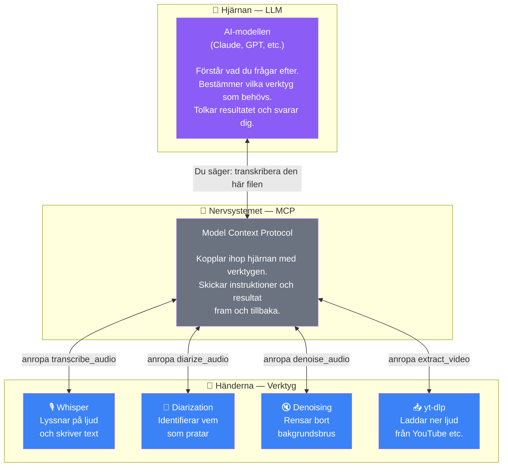
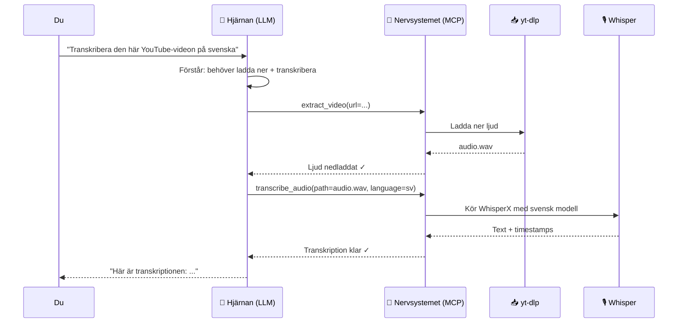

# Hur AI transkriberar — en enkel guide

## Tre delar som jobbar ihop

Tänk dig en människa som ska lyssna på en inspelning och skriva ner vad som sägs.

- **Hjärnan** bestämmer vad som ska göras — "lyssna på den här filen och skriv ner allt"
- **Nervsystemet** skickar signaler mellan hjärnan och kroppen — "höger hand, börja skriva nu"
- **Händerna** gör det fysiska jobbet — lyssnar, skriver, identifierar röster

I vårt system:

**Du pratar bara med hjärnan.** Du behöver inte veta att MCP eller Whisper finns — det sköts automatiskt.

## Vad du kan säga

### Det enklaste

> "Transkribera den här filen"

Det räcker. AI:n hanterar resten.

### Om du vet vilket språk det är

> "Transkribera på svenska"

Då väljs en svensk specialmodell som är bättre på svenska.

### Det smartaste tricket: berätta vad inspelningen handlar om

Whisper hör ljud och gissar vilka ord som sägs. Precis som du själv — om någon mumlar "etcd" och du inte vet vad Kubernetes är, kanske du hör "et cetera". Men om du VET att samtalet handlar om Kubernetes hör du rätt.

Samma sak med Whisper:

> "Transkribera den här filen. Det handlar om fordonssäkerhet. Namn och termer som förekommer: Marcus Purens, Helena Lindqvist, AUTOSAR, ImobMgr, ECU."

**Före** (utan ledtrådar):

| Whisper hör | Whisper skriver |
|---|---|
| "ImobMgr" | "Imob manager" ❌ |
| "SecOC" | "seco" ❌ |
| "Marcus Purens" | "Marcus Perens" ❌ |
| "etcd" | "et cetera" ❌ |

**Efter** (med ledtrådar):

| Whisper hör | Whisper skriver |
|---|---|
| "ImobMgr" | "ImobMgr" ✅ |
| "SecOC" | "SecOC" ✅ |
| "Marcus Purens" | "Marcus Purens" ✅ |
| "etcd" | "etcd" ✅ |

### Om det är flera personer som pratar

> "Transkribera och identifiera vem som säger vad. Det är 3 personer."

### Om inspelningen har dåligt ljud

> "Det är mycket bakgrundsbrus. Rensa ljudet och transkribera sedan."

## Automatisk termigenkänning

Du behöver inte alltid berätta vilka termer som förekommer. Systemet kan ta reda på det själv:

1. Det gör först en snabb, grov transkribering
2. En lokal AI (Gemma 4) läser igenom texten och plockar ut alla namn, förkortningar och tekniska termer
3. Sedan transkriberas filen igen med de extraherade termerna som ledtrådar — och stavningen blir rätt

Det här händer automatiskt om du inte själv anger termer. Men om du VET vilka termer som förekommer är det fortfarande snabbare att berätta det direkt — då slipper systemet det extra steget.

## Varning

Berätta bara om termer som **faktiskt sägs** i inspelningen. Om du skriver "Marcus Purens" men ingen nämner det namnet kan AI:n hitta på att det sägs ändå.

## Hela flödet — vad händer bakom kulisserna

När du säger *"Ladda ner den här YouTube-videon och transkribera på svenska"*:

Du ser bara det första och sista steget. Allt däremellan sker automatiskt.
