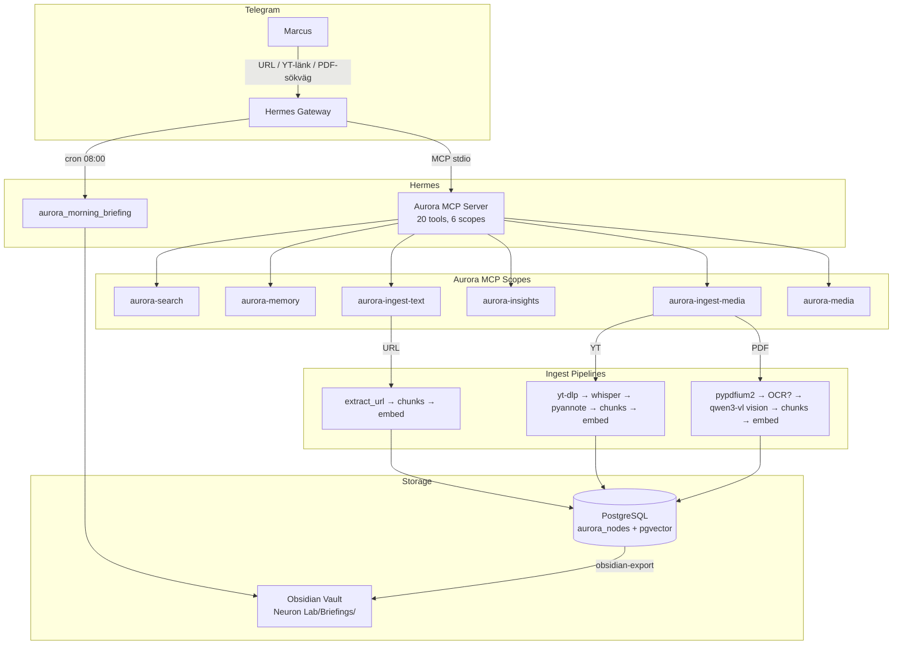
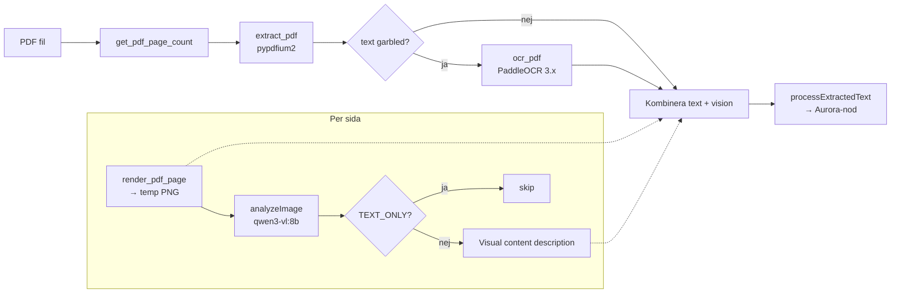

# HANDOFF-2026-04-02 — OpenCode Session 7: Hermes Briefing + Media Ingest + Hybrid PDF

## Systemöversikt efter session 7



## Hybrid PDF-pipeline (ny feature)



## Gjort

### 1. Morgonbriefing via Hermes

Extern config (utanför repo):

- `aurora-insights` scope tillagt i `~/.hermes/config.yaml` → exponerar `aurora_morning_briefing`
- Cron `morning_briefing` kl 08:00 → `telegram:8426706690`
- `croniter` installerat i Hermes venv (saknades)
- Gateway omstartad, MCP registrerar 16→20 tools

Testat manuellt: briefing genereras korrekt, skrivs till `~/Documents/Neuron Lab/Briefings/briefing-2026-04-02.md`.

**Ej verifierat:** Telegram-leverans kl 08:00 (LiteLLM-proxy hade connection errors vid manuellt test).

### 2. Media-indexering via Hermes

Lade till `aurora-ingest-media` + `aurora-media` scopes i Hermes config. 8 nya MCP-tools:

- `aurora_ingest_video` — async YT/video → transkript → diarize → chunks
- `aurora_ingest_pdf` — **NY** async PDF → OCR + vision → rich nodes
- `aurora_ingest_image`, `aurora_ingest_book`, `aurora_ocr_pdf`, `aurora_describe_image`
- `aurora_speakers`, `aurora_jobs`, `aurora_ebucore_metadata`

### 3. Pyannote diarization fix

- `pyannote.audio` installerad i Anaconda (`/opt/anaconda3/bin/python3`)
- numpy downgrad till 1.26.4 (pyannote kräver 2.x men pyarrow/sklearn kompilerade mot 1.x)
- `~/.hermes/aurora-mcp.sh` PATH utökad med `/opt/anaconda3/bin`
- Testat: Gangnam Style → 4 talare, 41s, MPS (Apple GPU)

### 4. PaddleOCR 3.x API-migrering

`aurora-workers/ocr_pdf.py` — PaddleOCR 3.4.0 har ny API (`predict()` istället för `ocr()`, inga `use_angle_cls`/`show_log` params). Uppdaterat med v3-support + v2-fallback.

### 5. Hybrid PDF-pipeline (OCR + Vision) — NY FEATURE

**`ingestPdfRich()`** i `src/aurora/ocr.ts`:

```
PDF → get_pdf_page_count
    → extract_pdf (pypdfium2 text)
    → isTextGarbled()? → OCR fallback (PaddleOCR)
    → per sida: render_pdf_page → temp PNG → analyzeImage() (qwen3-vl)
    → kombinera: [Page N]\n{text}\n[Visual content: {vision description}]
    → processExtractedText() → Aurora-nod
```

Asynkt via jobbkö:

- `startPdfIngestJob()` i `job-runner.ts` — skapar `aurora_jobs` row med `type = 'pdf_ingest'`
- `job-worker.ts` generaliserad — dispatchar baserat på `job.type`
- MCP tool: `aurora_ingest_pdf` registrerat i `aurora-ingest-media` scope

### 6. Obsidian käll-URL

`src/commands/obsidian-export.ts` — `source_url` (DB-kolumn) → `källa:` i frontmatter. Fallback: `props.videoUrl ?? props.sourceUrl ?? node.source_url`.

## Ej gjort / Nästa session

### 1. Testa hybrid PDF-pipeline end-to-end

`ingestPdfRich()` är byggt men **inte testat E2E**. Krävs:

- Ollama igång med `qwen3-vl:8b`
- En PDF med tabeller/grafer (Ungdomsbarometern funkar)
- Köa via `aurora_ingest_pdf` MCP tool
- Verifiera att Aurora-noden innehåller `[Visual content: ...]` sektioner

### 2. PDF OCR timeout-hantering

PaddleOCR tar ~20s/sida + 30s modell-laddning. 16-sidors PDF = ~6 min. Job-workern hanterar detta (async), men Hermes MCP timeout (30s) kan vara tight för initial queueing om metadata-fetch tar lång tid.

### 3. Roadmap-omskrivning

Marcus flaggade: nuvarande roadmap (`docs/ROADMAP.md`) skrevs före Hermes/OpenCode/Telegram. Många punkter är obsoleta eller redan gjorda. Behöver en ärlig inventering.

## Filer ändrade i repo

| Fil                                  | Ändring                                                       |
| ------------------------------------ | ------------------------------------------------------------- |
| `src/commands/obsidian-export.ts`    | +3 rader: source_url i interface, SQL, frontmatter            |
| `src/aurora/ocr.ts`                  | +~120 rader: `ingestPdfRich()`, imports                       |
| `src/aurora/job-runner.ts`           | +~60 rader: `startPdfIngestJob()`, types                      |
| `src/aurora/job-worker.ts`           | ~30 rader ändrade: generaliserad dispatch                     |
| `src/aurora/worker-bridge.ts`        | +2 actions i type union, relaxed metadata type                |
| `src/mcp/tools/aurora-ingest-pdf.ts` | **NY** ~45 rader                                              |
| `src/mcp/scopes.ts`                  | +2 rader: import + register                                   |
| `aurora-workers/ocr_pdf.py`          | ~50 rader: render_pdf_page, get_pdf_page_count, API-migrering |
| `aurora-workers/__main__.py`         | +3 rader: imports + handlers                                  |

## Filer ändrade utanför repo

| Fil                       | Ändring                           |
| ------------------------- | --------------------------------- |
| `~/.hermes/config.yaml`   | Scopes utökade, cron-jobb tillagt |
| `~/.hermes/aurora-mcp.sh` | `/opt/anaconda3/bin` i PATH       |
| Anaconda env              | pyannote.audio, numpy 1.26.4      |
| Hermes venv               | croniter                          |

## Verifiering

```
typecheck: clean
OCR tests: 16/16 passing
worker-bridge tests: 11/11 passing
MCP tools: 20 (verified via tools/list)
```
