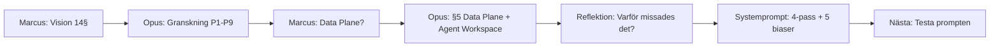

# HANDOFF — Projekt Bifrost grundläggning

> Datum: 2026-04-12 | Session: Bifrost #1

---

## Vad hände

Marcus presenterade en 14-sektions arkitekturvision för en AI-native Kubernetes-plattform. Han byter jobb till **Tjänsteägare för AI** på ett IT-bolag med 3000+ anställda. Start: mitten av maj 2026.

Opus granskade med websökningar, identifierade **9 förbättringsområden** (P1-P9), djupdök på 4 av dem (P5 compliance, P7 inference-mönster, P8 AI Hub, P9 modell-livscykel).

Marcus identifierade sedan en lucka som Opus missat: **hela Data Plane var tomt** — ingen databas, vektorisering, kunskapsgraf, agentminne eller workspace specificerat. Opus analyserade varför detta missades (granskade vad som stod, inte vad som saknades).

## Leverabler

```
docs/projekt-bifrost/
├── README.md
├── SYSTEMPROMPT-BIFROST.md          ← Systemprompt med 4-pass-modell
├── target-architecture.md            ← 20 sektioner, v1.1
├── rollout-plan-30-60-90.md          ← 3-fas plan (EJ uppdaterad med Data Plane)
├── chat-log.md                       ← Rå chatthistorik
├── logs/                             ← Tom, för framtida review-loggar
└── research/
    ├── gpu-scheduling-dra.md
    ├── vllm-kserve-production.md
    ├── llm-gateway-litellm.md
    ├── agent-governance-owasp.md
    ├── compliance-eu-ai-act-gdpr.md
    ├── inference-patterns-llmd.md
    ├── ai-hub-developer-portal.md
    ├── model-lifecycle-mlflow.md
    ├── kubecon-eu-2026-key-takeaways.md
    ├── data-plane-vector-graph-object.md
    └── agent-memory-workspace.md
```

## Nyckelarkitekturbeslut

| Komponent | Val | Motivering |
|-----------|-----|------------|
| GPU-schemaläggning | DRA (inte device plugins) | GA i K8s 1.34, attributbaserad matchning |
| LLM Gateway | LiteLLM | Multi-provider, multi-tenant, cost tracking |
| Vector Store | Qdrant | Rust, 8ms latency, enkel ops |
| Knowledge Graph | Neo4j | GraphRAG, HippoRAG, reasoning |
| Object Store | MinIO | S3-kompatibelt, K8s-native |
| Agent Workspace | K8s Agent Sandbox CRD | Stateful, isolerat, pause/resume |
| Agent Memory | A-MEM-inspirerat (3 lager) | Working → Episodic → Semantic |
| Developer Portal | Backstage | CNCF graduated, plugin-ekosystem |
| Model Registry | MLflow | Experiment tracking, LLM eval |
| Agent Governance | MS Agent Governance Toolkit | OWASP agentic top 10 |
| Serving | vLLM → KServe | Performance → orchestration |

## Kritiska deadlines

- **Mitten av maj 2026:** Marcus börjar nytt jobb
- **2 augusti 2026:** EU AI Act enforcement för högrisk-system

## Utfört senare i sessionen

1. **Rollout-plan v2.0** — alla tre faser uppdaterade med Data Plane-komponenter
2. **4-pass review utförd** — se `logs/review-2026-04-12.md`
   - 11 nya problem identifierade (P10-P20)
   - Viktigaste: Buy vs Build saknas, data residency saknas, RAG self-service saknas
3. **Budget-ramverk** — tillagt i rollout-planen med GPU, API, infra, personal, licenser

## Kvar att göra (nästa session)

1. **Adressera P10-P20** från 4-pass review (särskilt P12 data residency, P14 buy vs build)
2. **Fördjupa specifika sektioner** vid behov
3. **Operations/SRE-perspektivet** — on-call, runbook, incidenthantering (identifierat som miss i Pass 3)
4. **Change management** — kommunikationsplan till 3000 anställda

## Insikter från sessionen

1. **Granskning missar frånvaro.** En sammanhängande berättelse döljer sina luckor. Opus hittade 9 fel men missade att ett helt plan var tomt.
2. **Varför 5 gånger fungerar.** Femte varföret avslöjade rotorsaken: ingen referensmodell byggdes innan granskning. Ledde till Pass 0 i systemprompten.
3. **Systempromptens risk:** Den kan bli ett formulär att fylla i istället för en process som tvingar tänkande. Medveten om det.

## Systemprompt

`SYSTEMPROMPT-BIFROST.md` innehåller:
- 5 dokumenterade biaser
- 4 pass (0: referensmodell, 1: fel, 2: frånvaro, 3: meta + fem varför)
- Dokumentationskrav med arbetslogg
- Kontext om Marcus och projektet


