# HANDOFF — Bifrost Session 3: Fördjupning + 4-Pass Review

> Datum: 2026-04-13 | Session: Bifrost #3 | Target Architecture: v2.0 → v5.0

---

## Vad hände

Sessionen hade tre faser:

1. **Fördjupning av tre sektioner** (från S2-handoffen punkt 2)
2. **CGI-specifik compliance + branschkrav** (S2 punkt 3)
3. **4-pass review av hela dokumentet** (första formella helhetsgranskning)

Marcus testade leveransgaten systematiskt — varje gate-output ledde till nya uppgifter. Gate fungerar. Marcus kommenterade: "Gaten funkar ju jätebra! Wow!"

## Leverabler

### Target Architecture v5.0 (26 sektioner, ~2100 rader)

**Nya sektioner:**
- §20.8 Identity Lifecycle & Key Management
- §20.9 Encryption (transit/rest/use)
- §20.10 Vulnerability Management (skanningspipeline, patchcykel)
- §20.11 Secure Development Lifecycle
- §20.12 Pre-Production Security Review (gate per fas, CISO sign-off)
- §22.1 FinOps Governance (beslutshierarki, chargeback-modell, anomali-detektion)
- §23.3 SLOs & Error Budgets
- §23.4 Disaster Recovery & Backup (RPO/RTO per komponent)
- §23.5 Day-2 Operations (K8s-uppgraderingar, komponentuppgraderingar)
- §23.6 Operational Readiness Review
- §23.7 AI-assisterad SRE (fas 3+, explainability)
- §24.4 Migrationsväg — befintliga AI-lösningar
- §24.5 Champion Network & Executive Sponsorship
- §24.6 Success Metrics (adoption, plattform, värde)
- §26 Regulatory & Compliance Framework (8 subsektioner: CGI-kontext, regulatorisk matris, compliance-profiler, kunddata-segregering, EU AI Act, ISO 42001, säkerhetsskyddslagen, compliance-automatisering)
- §26.9 Compliance Dashboard — CISO-vy

**Fördjupade sektioner:**
- §8.6 Bifrost SDK — från sketch till fullständig design (modulstruktur, auth, felhantering, versioning, quickstart, golden paths, speed bumps)
- §12.4 Kunddata-segregering (tenant-id-taggning)
- §20.6 Omfokuserad till säkerhetsramverk (regulatoriskt → §26)
- §23.2 Incident Notification SLA (DORA-tidsramar, statuskanal)
- Incident Notification SLA med DORA-krav

**Fixar från 4-pass review:**
- §2: "Fem plan" → "Sex plan" (diagrammet visar sex)
- §5.7: Agent Sandbox flaggad som v0.2.1 alpha med fallback-plan
- §12.5: Dubblerad "(MIT-licens)" fixad
- §23/§24: Numreringsbugg fixad (22.x/23.x → 23.x/24.x)

### Rollout-plan v3.0
- ~30 nya compliance-milestones per fas
- 44 KPI:er i 7 kategorier (adoption, prestanda, säkerhet, compliance, drift, DX, ekonomi)
- 2 nya risker (SDK-adoption, compliance-gap)
- Compliance-beroenden i beroende-tabellen
- Security review gate per fas
- Post 90d: ISO 42001-certifiering, secure zone, AI-assisterad SRE v2

### Leveransgaten
Testad 5 gånger under sessionen. Varje gate genererade konkreta fynd som leddes till åtgärder. Marcus bekräftade att den fungerar. Insikt: gaten blivit lättare att köra — kan vara förbättring eller optimization-bias.

## 4-Pass Review — sammanfattning

### Pass 0 (Referensmodell)
Tre gap identifierade via explorativ sökning:
1. FinOps som designrestriktion (inte bara rapportering) → **fixat** (§22.1)
2. Data freshness SLI → **backlog**
3. Organisationsmodell / team topologies → **backlog**

### Pass 1 (Vad är fel?)
5 fynd: F1 sex/fem plan (**fixat**), F2 okällat GraphRAG-påstående (backlog), F3 Agent Sandbox alpha (**fixat**), F4 llm-d fas-timing (backlog), F5 MIT-licens-dubblering (**fixat**)

### Pass 2 (Vad saknas?)
12 frånvaro-fynd från 4 roller + auditor-perspektiv. A4 security gate (**fixat**), A5 notification SLA (**fixat**), A7 FinOps (**fixat**), A11 compliance evidence (**fixat**). 8 i backlog.

### Pass 3 (Meta-granskning)
Bias identifierade: Pass 0 var inte oberoende (påverkad av att ha läst dokumentet i 3 sessioner). Pass 1 bekräftade tekniker istället för att utmana val. Pass 2 saknade auditor- och framtids-perspektiv. Fem-varför-kedjor genomförda.

## Kvar att göra (prioriterat)

### P3 — Bör fixas

| # | Vad | Effort |
|---|-----|--------|
| A3 | Modellval-guidance (tabell i §8: "chatbot → modell X") | 20 min |
| A9 | MCP/A2A-protokollbeskrivning (hur agenter pratar med verktyg) | 30 min |
| R2 | Data freshness SLI (rad i §23.3 SLO-tabell) | 10 min |
| — | TOC / navigeringssektion (dokumentet är ~2100 rader) | 15 min |
| — | §25 sammanfattande princip (uppdatera med FinOps, security gate) | 10 min |
| — | Rollout-plan: security review gate-milestones per fas | 15 min |

### P4 — Backlog

| # | Vad |
|---|-----|
| A1 | Statussida-design (`status.bifrost.internal`) |
| A2 | Rate limit-transparens i SDK/dashboard |
| A6 | Third-party dependency risk (Qdrant/Neo4j/LiteLLM) |
| A8 | "Göra ingenting"-jämförelse i §22 |
| A10 | Inter-agent kommunikation / agent registry (fas 3+) |
| A12 | Organisatorisk beslutshierarki utöver FinOps |
| F2 | Källa för GraphRAG 80%-påstående |
| F4 | llm-d "fas 2-3" bör vara "fas 3+" |

### Från leveransgates (ej åtgärdade)

| Gate | Flagga |
|------|--------|
| Gate 3 (compliance) | §20.6 kan fortfarande överlappa §26.2 — renodlat men bör verifieras |
| Gate 4 (SDK) | §5.9 RAG-pipeline och SDK:s `rag.create()` — synkad men bör funktionstestas |
| Gate 5 (review) | §16 Observability saknar compliance-specifika signaler |
| Gate 5 (review) | Kyverno Policy Reporter bör nämnas explicit i §26.9 |

## Insikter

1. **Leveransgaten fungerar.** Varje gate hittade minst ett konkret fynd. Marcus drev den aktivt — "fixar du det gaten flaggade?" blev arbetsflödet.
2. **4-pass review avslöjar annorlunda saker än inkrementellt arbete.** De 12 frånvaro-fynden hade aldrig hittats under normalt "lägg till sektion"-arbete — de kräver perspektivbyte.
3. **Dokumentet börjar bli för stort för en fil.** ~2100 rader. En ny läsare behöver TOC. En CISO behöver executive summary. Nästa session bör adressera navigerbarhet.
4. **CGI-kontexten ändrade allt.** Compliance-sektionen (§26) hade aldrig blivit så specifik utan att veta att det är CGI. Branschkunskap = bättre arkitektur.
5. **FinOps som governance-disciplin var den största missen.** Kostnad som rapportering ≠ kostnad som designrestriktion. Pass 3:s fem-varför avslöjade rotorsaken.

```mermaid
flowchart LR
    A[S1: Vision + Review P1-P9] --> B[S2: P10-P20 + §20 Security]
    B --> C[S3: Fördjupning]
    C --> D[CGI = MAX compliance]
    D --> E[§26 Regulatory Framework]
    E --> F[4-pass review]
    F --> G[7 fixar P1+P2]
    G --> H[v5.0 — 26 sektioner]
    H --> I[Nästa: P3 + navigerbarhet]
```

