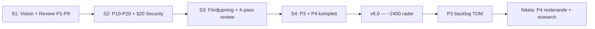

# HANDOFF — Bifrost Session 4: P3 + P4 komplett

> Datum: 2026-04-13 | Session: Bifrost #4 | Target Architecture: v5.0 → v6.0 | Rollout: v3.0 → v3.1

---

## Vad hände

Sessionen hade tre faser plus en bonus:

1. **Block 1:** TOC — innehållsförteckning med rollbaserad läsordning
2. **Block 2:** Tre innehållstillägg (modellval-guide, MCP/A2A-protokoll, data freshness SLI)
3. **Block 3:** §25 uppdaterad + security review gate-milestones i rollout-planen
4. **Bonus:** Alla 6 P4-items från leveransgates fixade direkt

All P3-backlog från session 3 är avklarad. Alla leveransgate-fynd åtgärdade.

## Leverabler

### Target Architecture v6.0 (~2400 rader, +~300 från v5.0)

**Nya sektioner:**
- **Innehållsförteckning** — tabellformat med 26 rader + rekommenderad läsordning per roll (6 roller inkl. Executive sponsor)
- **§8.5b Modellval-guide** — rekommendationsmatris (8 användningsfall), dataklass-routing, GPU-pristabell (A100/H100/B200 med throughput + $/Mtok), FP4-kvalitetsavvägning per användningsfall
- **§8.7 Agent-protokoll — MCP och A2A** — arkitekturdiagram, MCP-server-katalog (6 servrar), OAuth 2.1 auth-flöde (4 steg med diagram), A2A-scenarier, tre kommunikationsmönster, fasning, governance-koppling, samspelsdiagram, SDK vs MCP auth-förklaring

**Uppdaterade sektioner:**
- **§20.12** — RACI-matris för security review gate (6 aktiviteter × 4 RACI-roller)
- **§23.3** — Data Freshness SLI: < 15 min p95 (dokument-ändring → uppdaterad vektor)
- **§25** — Sammanfattande princip utökad med MCP/A2A, FinOps som designrestriktion, modellval-guide

### Rollout-plan v3.1

- **Security Review Gate** som explicit leverabel per fas:
  - Fas 1: Threat model godkänd, NetworkPolicies, audit trail → CISO sign-off
  - Fas 2: Infra-pentest, SOC, dataklass-routing, PII → CISO sign-off
  - Fas 3: AI-pentest, cross-tenant, honeypots, agent governance → CISO sign-off full drift

### Leveransgates

5 gates körda (1 per block + 2 bonus). Varje gate fångade minst ett fynd:
1. TOC: ankarlänkar med svenska tecken, saknad läsordning per roll → fixad
2. A3+A9+R2: MCP auth-gap (CISO-perspektiv) → fixad direkt med OAuth 2.1-not
3. §25+rollout: RACI saknas för security gate (SRE-perspektiv) → fixad
4. P4-block: SDK vs MCP auth-skillnad (utvecklarperspektiv) → förklarad
5. Implicit: FP4-kvantisering kan påverka reasoning-kvalitet → tabell tillagd

## P3-backlog — AVKLARAD ✅

| Item | Status |
|------|--------|
| A3 Modellval-guidance | ✅ Klar (§8.5b) |
| A9 MCP/A2A-protokoll | ✅ Klar (§8.7) |
| R2 Data freshness SLI | ✅ Klar (§23.3) |
| TOC | ✅ Klar |
| §25 uppdatera | ✅ Klar |
| Rollout security gates | ✅ Klar |

## P4-backlog — AVKLARAD ✅

| Item | Status |
|------|--------|
| RACI för security review gate | ✅ Klar (§20.12) |
| TOC med läsordning per roll | ✅ Klar |
| MCP auth detaljerat (OAuth 2.1) | ✅ Klar (§8.7) |
| Modellval-kostnadssiffror verifierade | ✅ Klar (B200 benchmarks) |
| SDK vs MCP auth-förklaring | ✅ Klar (§8.7) |
| FP4-kvantiseringskvalitet | ✅ Klar (§8.5b) |

## Kvar att göra (P4 — backlog från session 3)

| # | Vad | Effort |
|---|-----|--------|
| A1 | Statussida-design (`status.bifrost.internal`) | 20 min |
| A2 | Rate limit-transparens i SDK/dashboard | 15 min |
| A6 | Third-party dependency risk (Qdrant/Neo4j/LiteLLM) | 30 min |
| A8 | "Göra ingenting"-jämförelse i §22 | 20 min |
| A10 | Inter-agent kommunikation / agent registry (fas 3+) | 30 min |
| A12 | Organisatorisk beslutshierarki utöver FinOps | 20 min |
| F2 | Källa för GraphRAG 80%-påstående | 10 min |
| F4 | llm-d "fas 2-3" bör vara "fas 3+" | 5 min |

### Från leveransgates (ej åtgärdade)

| Gate | Flagga |
|------|--------|
| Gate 3 (S3) | §20.6 kan fortfarande överlappa §26.2 |
| Gate 4 (S3) | §5.9 RAG-pipeline och SDK:s `rag.create()` — synkad men bör funktionstestas |
| Gate 5 (S3) | §16 Observability saknar compliance-specifika signaler |
| Gate 5 (S3) | Kyverno Policy Reporter bör nämnas explicit i §26.9 |

## Research-källa noterad

**AI Engineer** (@aiDotEngineer) — YouTube-kanal med 629 videor, 395k prenumeranter. Relevant för Bifrost-beslut kring agent-infrastruktur, MCP/A2A, plattformsarkitektur. Inhämtning parkerad — behöver lösning för bulk-transkribering.

## Insikter

1. **Leveransgaterna producerar arbete.** Varje gate genererade minst ett fynd som var värt att fixa. Mönstret "leverera → gate → fixa gate-fynd" är nu arbetsflödet. Marcus bad explicit om att fixa gate-fynd — det är inte overhead, det är kvalitet.

2. **B200 ändrar kostnadskalkylen radikalt.** ~4× throughput/$ vs H100 med FP4. En B200 kör Llama 70B som krävde 4× A100. Det påverkar rollout-planens GPU-profil — kan behöva uppdateras.

3. **MCP + A2A är komplementära, inte konkurrerande.** MCP = vertikal (agent ↔ plattform), A2A = horisontell (agent ↔ agent). Bifrost levererar MCP från fas 2, A2A från fas 3. Båda förvaltas av AAIF/Linux Foundation.

4. **Auth-modellen måste vara begriplig för utvecklare.** SDK (API-nyckel) vs MCP (OAuth 2.1) för samma kapabilitet kan förvirra. Den explicita förklaringen ("olika trust-nivåer") löser det.

5. **P3-backlogen är tom.** Första gången sedan session 1. Det betyder att dokumentet nu är i ett "polish"-läge — kvarvarande items (P4) är förbättringar, inte luckor.

