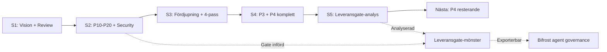

# HANDOFF — Bifrost Session 5: Leveransgate-djupanalys

> Datum: 2026-04-13 | Session: Bifrost #5 | Target Architecture: v6.0 (oförändrad) | Rollout: v3.1 (oförändrad)

---

## Vad hände

Marcus bad Opus läsa session 4-handoffen och systemprompten, sedan djuptänka om varför leveransgaten fungerat så bra. Sessionen producerade en djupanalys (~550 rader) med ordagranna tankeresor, annoterad källtext och generaliserbara principer.

Ingen arkitektur- eller rollout-förändring. Sessionen var meta — analys av *processen*, inte *produkten*.

## Leverabler

### Djupanalysrapport

**Fil:** `docs/samtal/samtal-2026-04-13T2200-leveransgate-djupanalys.md`

**Innehåll:**
- **Del 0:** Hela leveransgate-sektionen från systemprompten, annoterad med **→**-markeringar vid varje avgörande formulering + förklaring av *varför* formuleringen fungerar
- **Del 1-9:** Ordagranna tankeresor (genererings-momentum, attention-vikter, rad-för-rad-analys, timing, 5-varför-kedja, meta-kognition, förtroende-loop)
- **2 Mermaid-diagram:** komplett flöde med alla beslutspunkter + konkret session 4-exempel
- **Sammanfattningstabell:** 10 avgörande formuleringar med mekanism

### Dagböcker

- `dagbok-2026-04-13-allman-session5.md` — allmän (icke-utvecklare)
- `dagbok-2026-04-13-senior-session5.md` — senior/arkitekt
- `dagbok-2026-04-13-llm-session5.md` — LLM-optimerad

## Kärninsikt

**Leveransgaten fungerar för att den hackar LLM-träningsbias.**

RLHF optimerar modeller för uppgiftslösning. Bakgrundsinstruktioner ("var noggrann", "kör frånvaro-pass") förlorar mot uppgiftslistor ("adressera P10-P20") i attention-konkurrensen. Gaten löser det genom att formulera kvalitetsgranskning *som en uppgift* — samma format modellen redan optimerar för.

## 5 designprinciper (generaliserbara)

| # | Princip | Exempel från gaten |
|---|---------|-------------------|
| 1 | Uppgift slår bakgrund | Gaten är 4 uppgifter, inte en instruktion |
| 2 | Struktur slår intention | "Skriv 4 rader" > "var noggrann" |
| 3 | Frånvaro kräver tvång | "minst 2 du INTE kollade" > "vad missade du?" |
| 4 | Extern signal bryter intern koherens | Rad 4 kräver sökning, inte bara reflektion |
| 5 | Timing > innehåll | "INNAN du presenterar" = obligatoriskt |

## Identifierade risker med gaten

1. **Ritualisering** — om gaten alltid producerar fynd kan den generera fyllnad
2. **Fossilisering** — samma format varje gång → samma typ av svar
3. **Meta-gate-asymmetri** — "aldrig fynd" triggar omprövning, men "alltid fynd" granskas inte

**Förslag:** Rotera rad 2-formatet för att motverka fossilisering.

## Implikation för Bifrost-agenter

Leveransgate-mönstret bör appliceras på alla agenttyper i Bifrost:
- RAG-agent: "vilka källor kollade jag INTE?"
- Kod-agent: "vad testade jag INTE?"
- Granskningsagent: "vilket perspektiv tog jag INTE?"

Koppling till §26 Agent Governance — kan bli en rekommendation i target architecture.

## Kvar att göra (oförändrat från session 4)

| # | Vad | Effort |
|---|-----|--------|
| A1 | Statussida-design | 20 min |
| A2 | Rate limit-transparens | 15 min |
| A6 | Third-party dependency risk | 30 min |
| A8 | "Göra ingenting"-jämförelse | 20 min |
| A10 | Inter-agent kommunikation | 30 min |
| A12 | Organisatorisk beslutshierarki | 20 min |
| F2 | Källa för GraphRAG 80% | 10 min |
| F4 | llm-d faskorrigering | 5 min |

Plus 4 gate-flaggor från session 3 (§20.6/§5.9/§16/Kyverno).

## Insikter

1. **Processen blir viktigare ju fler sessioner som passerar.** Session 1-4 byggde innehåll. Session 5 analyserade processen. Kvaliteten på framtida innehåll beror på kvaliteten på processen — den här analysen är en investering.

2. **Gaten som mönster är exporterbar.** Den är inte Bifrost-specifik. Varje LLM-baserat arbetsflöde som kräver kvalitetssäkring kan använda varianter av samma mekanism.

3. **"Teater, inte gate" är den starkaste formuleringen i hela prompten.** Emotionell laddning fungerar i LLM-instruktioner — inte som manipulation, utan som signal som höjer vikten av distinktionen.

