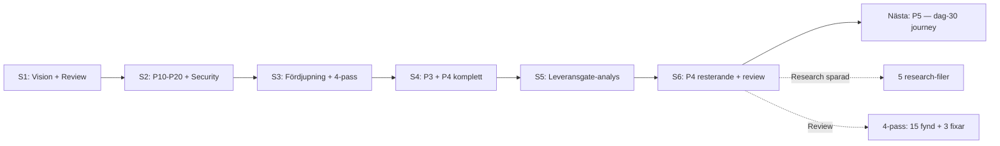

# HANDOFF — Bifrost Session 6: P4 komplett + 4-pass review

> Datum: 2026-04-13 | Session: Bifrost #6 | Target Architecture: v7.0 | Rollout: v3.2

---

## Vad hände

Sessionen hade tre faser:

1. **P4-backlog clearance** — Alla 8 kvarvarande P4-items + 4 gate-flaggor åtgärdade. Target architecture v6.0 → v7.0 (+274 rader).
2. **4-pass formal review** — 15 tekniker verifierade, 15 frånvarofynd, meta-granskning. 3 teknikfixar gjorda direkt.
3. **Parallella uppgifter** — Rollout-plan uppdaterad, A1-rapport läst, Aurora-tester körda, bulk-transkribering researched, research-filer sparade.

## Leverabler

### Target Architecture v7.0 (~2800 rader)

**Nya sektioner:**
- §16.4 Compliance-signaler (9 signaler med regelverk-mappning)
- §21.1 Third-party dependency risk (Qdrant/Neo4j/LiteLLM med riskmatris)
- §22.2 Göra-ingenting-scenario (1-3M SEK/år merkostnad)
- §22.3 Organisatorisk beslutshierarki (10 beslutskategorier)
- §23.2 Statussida-design (status.bifrost.internal)
- §8.6 Rate limit-transparens (headers + dashboard)
- §8.7 Agent Registry & Discovery

**Uppdaterade sektioner (review-fixar):**
- §7.6 SGLang som alternativ till vLLM (29% bättre för agentic)
- §5.6 A-MEM mognadsnotering + Mem0/Zep alternativ
- §12.5 MS Agent Governance Toolkit mognadsrisk + fallback
- §5.3 GraphRAG-källa korrigerad
- §25 Sammanfattande princip uppdaterad

### Rollout-plan v3.2

Synkad med v7.0. Nya leverabler per fas:
- Fas 1: statussida, LiteLLM pinning, Kyverno Policy Reporter, compliance-signaler
- Fas 2: rate limit-transparens, LiteLLM alternativ-utvärdering
- Fas 3: Agent Registry, intern A2A, beslutshierarki
- Post 90d: cross-tenant A2A, Neo4j-migrationsplan

2 nya risker: LiteLLM supply chain, Neo4j licenslåsning.

### Research (5 nya filer)

| Fil | Innehåll |
|-----|----------|
| `research/sglang-vs-vllm-2026.md` | SGLang vs vLLM benchmarks, relevans för Agent Plane |
| `research/litellm-supply-chain-2026.md` | Supply chain-attack mars 2026 — 40k drabbade, 6 källor |
| `research/dependency-risk-qdrant-neo4j-litellm.md` | Riskprofil per komponent |
| `research/a-mem-agent-memory-2026.md` | A-MEM status + Mem0/Zep alternativ |
| `research/review-v7-tech-verification.md` | 15 tekniker verifierade med källor |

### Review Log

`docs/projekt-bifrost/logs/review-2026-04-13-v7.md` — komplett 4-pass review.

### Dagböcker

- `dagbok-2026-04-13-allman-session6.md`
- `dagbok-2026-04-13-senior-session6.md`
- `dagbok-2026-04-13-llm-session6.md`

## 4-pass review — sammanfattning

### Pass 0: Referensmodell
4 saknade mot oberoende referensmodell: feature store, prompt management, fine-tuning pipeline, document processing pipeline.

### Pass 1: Teknologiverifiering
12/15 korrekta. 3 fixade:

| Teknik | Fynd | Åtgärd |
|--------|------|--------|
| vLLM | SGLang 29% bättre för agentic | §7.6 uppdaterad |
| A-MEM | Research-grade | §5.6 mognadsnotering |
| MS Agent Governance | 11 dagar gammalt | §12.5 fallback-plan |

### Pass 2: Frånvaroanalys (4 roller)
15 fynd. Topp 3:
1. Debugging/troubleshooting-guide saknas (dag-30-perspektiv)
2. Runbook-standardformat saknas
3. Agent rate limits ej differentierade

### Pass 3: Meta-granskning
Rotorsak: alla sessioner har "framåt"-perspektiv. Ingen session har frågat "vad händer 3 månader efter launch?"

## Kvar att göra (P5-backlog)

| # | Vad | Effort |
|---|-----|--------|
| P4 | Debugging/troubleshooting-guide (dag-30 journey) | 30 min |
| P5 | Runbook-standardformat | 15 min |
| P6 | Plattforms-evolution (K8s-uppgraderingar, dependency-rotation) | 20 min |
| P7 | Feature store, prompt management, fine-tuning design | 30 min |

## Övriga resultat (ej Bifrost)

- **Neuron HQ A1-rapport:** GRÖN. 12/12 AC, 3936 tester, 0 regressioner
- **Neuron HQ-tester:** 4081 passed, 5 failed (timeout + policy)
- **Bulk-transkribering:** 3 alternativ identifierade (yt-dlp, Whisper batch, pyannote)

## Insikter

1. **LiteLLM supply chain-attacken ändrar kalkylen.** Mars 2026: 40 000 installationer komprometterade. Det är inte en teoretisk risk — det hände. Portkey/Kong bör utvärderas seriöst i fas 2.

2. **SGLang-skiftet är nytt.** vLLM var rätt val 2025. I april 2026 leder SGLang för agentic workloads. llm-d (CNCF) wrappar vLLM — det kan bli en strategisk missmatch om SGLang fortsätter leda.

3. **Research-filer i repot är värt investering.** Marcus noterade att arkitekturdokumentet bör kunna länka till sparad research. 5 nya filer skapade. Framtida sessions bör spara all research direkt.

4. **Dag-30-perspektivet är den viktigaste saknade dimensionen.** Alla sessioner har byggt framåt. Ingen har frågat "vad går fel efter launch?" Det är nästa sessions viktigaste bidrag.

