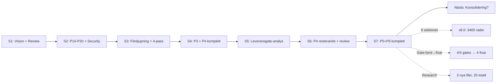

# HANDOFF — Bifrost Session 7: P5+P6-backlog komplett

> Datum: 2026-04-14 | Session: Bifrost #7 | Target Architecture: v8.0 | Rollout: v4.0

---

## Vad hände

Sessionen hade två faser:

1. **P5-backlog clearance** — Alla 4 items från session 6:s 4-pass review: debugging guide, runbook-format, plattforms-evolution, prompt management + fine-tuning + context assembly.
2. **P6-gate-fixar** — 4 leveransgate-fynd åtgärdade direkt: MTTR-besparing, fine-tuning threat model, deprecation alerts, eskaleringsbrygga.

## Leverabler

### Target Architecture v8.0 (~3400 rader, +600 från v7.0)

**Nya sektioner:**

| Sektion | Innehåll | Rader |
|---------|----------|-------|
| §23.1 utökad | Runbook-standardformat, obligatoriska fält, livscykel, exempelrunbook RB-001, prioriterad lista per fas | ~120 |
| §23.8 | Debugging & Troubleshooting Guide — dag-30 developer journey, decision tree, 6 vanliga problem, self-service verktyg, felkatalog (8 koder), eskaleringsmatris, eskaleringsbrygga (§23.8→§23.2) | ~150 |
| §23.9 | Plattforms-evolution — tech radar (5 ringar), dependency-rotation (5 triggers), konsument-notifiering/deprecation alerts, arkitektur-review-cykel (6 frågor), team offboarding | ~130 |
| §27.1 | Prompt Management — Langfuse-baserad prompt registry, 7 principer, A/B-testning, eval-gate, governance | ~60 |
| §27.2 | Fine-Tuning Pipeline — QLoRA, 4-stegs arkitektur, adapter hot-loading i vLLM, governance per risklass | ~80 |
| §27.3 | Context Assembly Layer — motiverade varför feature store inte behövs, vad som behövs istället | ~50 |

**Uppdaterade sektioner (gate-fixar):**

| Sektion | Vad | Källa |
|---------|-----|-------|
| §22 | Operations-besparingar, MTTR-tabell, kvantifiering ~30K SEK/mån | Gate P5 (CTO-rollbyte) |
| §20.2 | 1 ny angriparprofil, 3 nya attackvektorer (data poisoning, adapter backdoor, eval manipulation) | Gate P7 (CISO-rollbyte) |
| §20.4 | 2 nya SIEM-events (fine-tuning anomali, adapter eval-failure) | Gate P7 |
| §25 | Sammanfattande princip utökad med runbooks, tech radar, prompt management, fine-tuning, context assembly | — |
| TOC | §27 tillagd, §23 "9 subsektioner", läsordning uppdaterad | — |

### Rollout-plan v4.0

+25 nya leverabler fördelade per fas:

| Fas | Nya leverabler (urval) |
|-----|----------------------|
| Fas 1 | Felkatalog, 6 runbooks i standardformat, tech radar v1, Langfuse prompt management |
| Fas 2 | Retrieval quality dashboard, prompt playground, reranker, fine-tuning design, kvartalsvis tech radar-review |
| Fas 3 | Eval dashboard, första fine-tuning (QLoRA), adapter registry, full context assembly, tech radar i Backstage |
| Post 90d | Per-tenant adapters, Feast-utvärdering, AI-assisterad felsökning |

### Research (3 nya filer, totalt 20)

| Fil | Innehåll |
|-----|----------|
| `research/dag-30-developer-problems.md` | Dag-30-problem, self-service debugging, decision trees, felkatalog-mönster |
| `research/runbook-format-platform-evolution.md` | Google SRE/PagerDuty-format, tech radar-modell, AI-plattform tech debt |
| `research/feature-store-prompt-mgmt-finetuning.md` | Feature store-evolution, Langfuse prompt mgmt, QLoRA/adapter hot-loading |

### Chattlogg

`docs/projekt-bifrost/chat-log.md` uppdaterad med S7-001 till S7-007.

## Leveransgate-sammanfattning

8 leveransgates kördes (4 för P5-backlog, 1 samlad för P6-gate-fixar). Roller roterades: SRE → CTO → utvecklare → CISO → extern auditor.

**Åtgärdade gate-fynd (inom sessionen):**

| Gate-källa | Fynd | Åtgärd |
|-----------|------|--------|
| P4 (SRE) | §23.8→§23.2 koppling odefinerad | P11: eskaleringsbrygga med flöde + klassificering |
| P5 (CTO) | §22 saknar operations-besparingar | P8: MTTR-tabell + kvantifiering |
| P6 (utvecklare) | Tech radar → konsument-notifiering saknas | P10: deprecation alerts + SDK-header |
| P7 (CISO) | §20.2 saknar fine-tuning-hot | P9: 3 attackvektorer + 2 SIEM-events |

**Ej åtgärdade gate-fynd (P7-backlog):**

| # | Fynd | Källa | Effort |
|---|------|-------|--------|
| P12 | Executive summary / compliance summary (auditor kan läsa på 10 min) | Gate P8-P11 (auditor-rollbyte) | 20 min |
| P13 | Verifiera Langfuse A/B-testning som inbyggd feature | Gate P7 | 10 min |
| P14 | Verifiera vLLM adapter hot-loading + KServe-kompatibilitet | Gate P7 | 10 min |
| P15 | CGI timkostnad-verifiering (1000 SEK/h antagande i §22) | Gate P8 | 5 min |

## Insikter

1. **Leveransgate-systemet fungerar.** 4 av 4 P5-gates hittade reella luckor (inte teater-fynd). Alla 4 fixades inom sessionen som P8-P11. Det är den mest produktiva gate-rundan hittills.

2. **Dag-30-perspektivet var den viktigaste saknade dimensionen.** Session 6:s 5-varför pekade på det: alla sessioner hade "framåt"-perspektiv. §23.8 (debugging guide), §23.9 (plattforms-evolution) och eskaleringsbryggan adresserar det. Dokumentet har nu både bygg-perspektiv och drift-perspektiv.

3. **Feature store-fällan undveks.** Research visade att traditionell feature store inte behövs för LLM-plattformar — Qdrant + context assembly fyller den rollen. §27.3 dokumenterar *varför* istället för att tvinga in en komponent som inte hör hemma. Det är en anti-leverans — att specificera vad som *inte* behövs är ibland viktigare.

4. **Dokumentet närmar sig konsolideringspunkt.** 3400 rader, 27 sektioner. Auditor-gaten flaggade att det saknas en 10-minuters-sammanfattning. Nästa session bör troligen handla om konsolidering (executive summary, redundansrensning) snarare än expansion.

5. **Langfuse är en kraftmultiplikator.** Den dyker upp i §16 (observability), §23.8 (debugging), §27.1 (prompt management) och §27.2 (data curation). En komponent som löser fyra problem. Det validerar valet.

