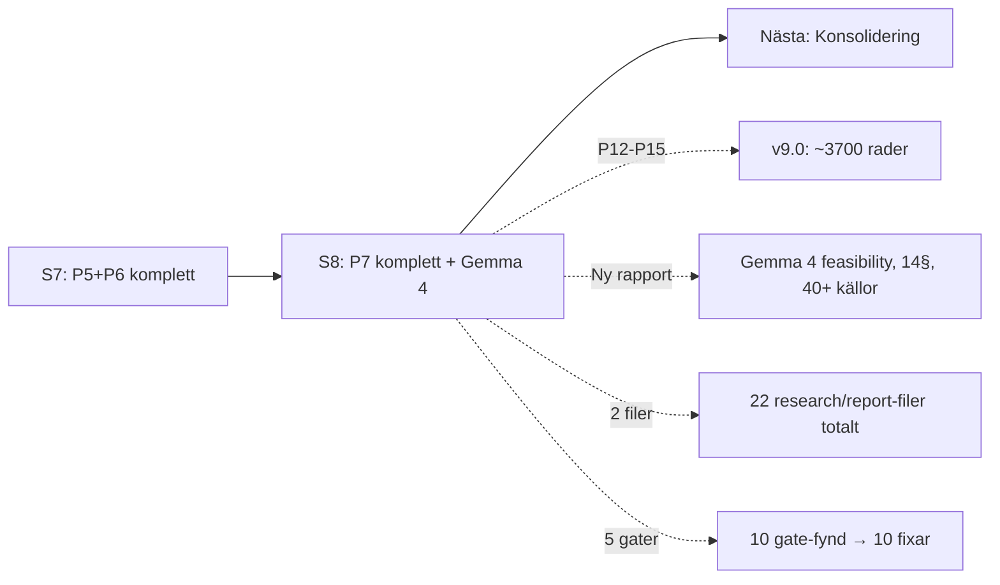

# HANDOFF — Bifrost Session 8: P7-backlog komplett + Gemma 4-rapport

> Datum: 2026-04-14 | Session: Bifrost #8 | Target Architecture: v9.0 | Rollout: v5.0

---

## Vad hände

Sessionen hade tre faser:

1. **P14 inference-landskapsresearch** — Bred explorativ sökning (inte bara vLLM vs SGLang). Hittade llm-d, ShadowMQ-sårbarheter och Envoy AI Gateway. Target architecture och rollout-plan uppdaterade.
2. **P12 Executive Summary** — 10-minuters-sammanfattning för auditor/CTO med compliance-statusmatris.
3. **P13 + P15 verifieringar** — Langfuse A/B-testning bekräftad som inbyggd feature. 1000 SEK/h verifierad mot marknad.

Dessutom: Marcus ställde frågan "Kan Gemma 4 bygga Bifrost?" — det blev en djuprapport med produktivitetsresearch, t/s-analys och managed vs self-hosted-jämförelse.

## Leverabler

### Target Architecture v8.0→v9.0

**Nya/ändrade sektioner:**

| Sektion | Ändring | Trigger |
|---------|---------|---------|
| ES (ny) | Executive Summary (~80 rader, compliance-statusmatris, läsordning för auditor) | P12 |
| §2 | Sexplans-diagram uppdaterat: llm-d + K8s Inference Gateway | P14 |
| §3b | ai-serving-zon utökad med llm-d-komponenter | P14 |
| §6 | Rubrik + diagram: "LiteLLM → Envoy fas 2", llm-d routing-lager, migreringstext | P14 gate |
| §7.5 | Routing-diagram omritat med K8s Inference Gateway + disaggregerade pods | P14 gate |
| §7.6 | Omskriven: llm-d från "bevaka" till rekommenderad. SGLang degraderad till Hold (CVE). TGI deprecated. Fasning. | P14 |
| §20.2 | Ny attackvektor: ShadowMQ inference-motor supply chain (30+ CVE:er) | P14 |
| §20.4 | Nytt SIEM-event: ZMQ-deserialisering | P14 |
| §21.1 | Envoy AI Gateway som primärt LiteLLM-alternativ | P14 |
| §22 | Fotnot: 1000 SEK/h verifierad mot marknad (800-1200 SEK/h) | P15 |
| §23.9 | Tech radar uppdaterad (llm-d Trial→Adopt, SGLang Hold, TGI deprecated, Envoy Assess, K8s Inf GW Trial) | P14 |
| §25 | Hänvisning till Executive Summary | P12 gate |
| §27.1 | A/B-testning: nyans — Langfuse trackar, applogik routar | P13 |
| §27.2 | Adapter hot-loading-begränsning + Punica-mönster + LoRA-varianter | P14 |
| TOC | ES tillagd, auditor-läsordning | P12 |

### Rollout-plan v4.0→v5.0

| Fas | Ändringar |
|-----|-----------|
| Fas 1 | vLLM ≥0.11.1 krav (ShadowMQ) |
| Fas 2 | +6 leverabler: llm-d deployment, K8s Inference Gateway, Envoy-utvärdering, RB-007 llm-d-runbook, SGLang-patchkontroll, uppdaterad gateway-utvärdering |
| Post 90d | llm-d "utvärdera" → "full disaggregering alla mönster", LiteLLM-beslut → Gateway-beslut (Envoy inkluderad) |
| Risker | +ShadowMQ inference-motor CVE:er, LiteLLM-rad uppdaterad |

### Gemma 4-rapport (ny)

`docs/projekt-bifrost/reports/gemma4-bifrost-build-feasibility.md` — 14 sektioner, 40+ källor.

**Nyckelinsikter:**
1. Gemma 4 kan bygga ~50-60% av komponenterna, inte helheten
2. Claude API billigare än lokal RTX 4090 vid <2M tokens/dag
3. METR-studien: erfarna devs 19% *långsammare* med AI (men tror de är snabbare)
4. AI-kod har 1.7x fler defekter i produktion
5. TTFT (inte throughput) är flaskhalsen för agent-loopar
6. Managed plattform aldrig rätt val för CGI (Mythos-argumentet + utvecklingstakt)
7. 4 devs med agenter = ~10-25% snabbare totalt, inte 2-3x

### Research (2 nya filer, totalt 22)

| Fil | Innehåll |
|-----|----------|
| `research/inference-landscape-2026.md` | vLLM, SGLang, llm-d, TGI deprecated, ShadowMQ, Envoy AI Gateway, adapter-serving, EU AI Act inference-krav |
| `reports/gemma4-bifrost-build-feasibility.md` | Gemma 4 kapabiliteter, 4 devs utan/med agenter, t/s-analys, kostnadsjämförelse, managed vs self-hosted |

## P7-backlog: TOM

| # | Fynd | Status |
|---|------|--------|
| P12 | Executive summary | ✅ Klar |
| P13 | Verifiera Langfuse A/B-testning | ✅ Inbyggd, nyans dokumenterad |
| P14 | Verifiera vLLM adapter hot-loading + KServe | ✅ Bredare: hela inference-landskapet |
| P15 | CGI timkostnad-verifiering | ✅ 1000 SEK/h = mitt i marknad |

## Leveransgater körda

5 gater kördes under sessionen. Roller: SRE, auditor, CTO, utvecklare.

**Gate-fynd åtgärdade inom sessionen:**
- §6-diagram saknades Envoy → uppdaterat
- Rollout-plan saknade llm-d i fas 2 → tillagd
- llm-d-runbook saknades → RB-007 som fas 2-leverabel
- Compliance-status i ES → matris tillagd
- §25 ur synk med ES → hänvisning tillagd
- Rapporten nämnde Neuron HQ → borttaget (Bifrost-fokus)
- METR-studien gäller algoritmik, inte DevOps → nyans tillagd
- Concurrent t/s vid 4 agenter → tabell tillagd
- Team-workflows som fungerar → 3 mönster tillagda
- Managed-slutsatsen var för generös → korrigerad med Mythos-argument

## Insikter

1. **llm-d var den största överraskningen.** Kubernetes-nativ disaggregerad inference — backas av Red Hat, AWS, NVIDIA, Google. v0.5 GA. Det ändrar Bifrosts inference-arkitektur från "vLLM direkt" till "llm-d wrapper med disaggregering som default".

2. **SGLang är farlig just nu.** 29% bättre throughput men opatchade RCE:er (CVE-2026-3059/3060/3989). Maintainers har inte svarat på disclosure. Hold tills vidare.

3. **Claude API är billigare än lokal GPU** vid typisk agent-användning. Kostnadsargumentet för self-hosted gäller vid hög volym (>2M tok/dag) eller air-gap-krav — exakt det Bifrost är designat för.

4. **Erfarna utvecklare blir långsammare med AI** (METR, -19%). Men AI snabbar upp boilerplate (+55%). Nettoeffekt: 10-25% snabbare totalt — om arbetet struktureras rätt.

5. **Managed plattformar fungerar inte för CGI.** Inte bara pga säkerhetsskyddslagen — pga utvecklingstakten. Kapabiliteter (llm-d, Mythos) skiftar snabbare än leverantörer kan leverera. Kontroll > bekvämlighet.

## Nästa session: Konsolidering

Dokumentet är ~3700 rader. P7-backlog tom. Nästa session bör fokusera:

1. **Redundansrensning** — saker som sägs på flera ställen
2. **§25 omskrivning** — sammanfattande princip ur synk med v9.0 (llm-d, Envoy, adapter-begränsningar saknas)
3. **Konsistenskontroll** — alla sektioner alignade med inference-ändringarna
4. **Eventuellt: krympa** — finns det sektioner som kan slås ihop?

Kräver fräsch kontextfönster — hela dokumentet behöver läsas uppifrån och ner.
