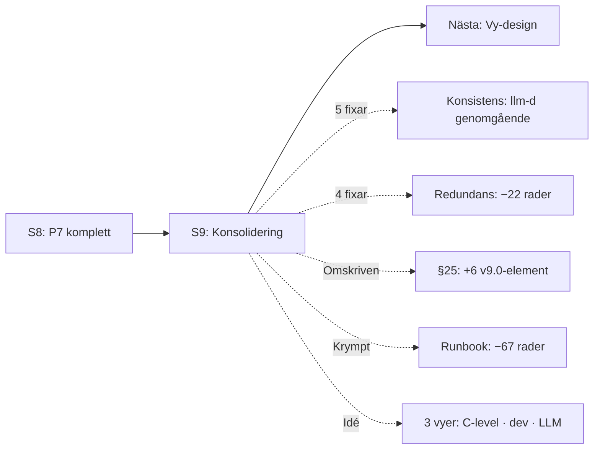

# HANDOFF — Bifrost Session 9: Konsolidering

> Datum: 2026-04-14 | Session: Bifrost #9 | Target Architecture: v9.1 (konsoliderad) | Rollout: v5.0 (oförändrad)

---

## Vad hände

Sessionen var en ren konsolidering — ingen ny kunskap, inga nya sektioner. Syftet var att synka hela dokumentet med v9.0-ändringarna (llm-d, Envoy, SGLang Hold, K8s Inference Gateway, adapter-begränsningar) och ta bort redundans.

Dessutom: Marcus ställde frågan "Kan dokumentet skrivas i 3 versioner? C-level, seniora utvecklare, LLMs?" — det blev en insikt om vy-generering som nästa sessions huvuduppgift.

## Leverabler

### Target Architecture v9.0→v9.1

**Typ: konsolidering (ingen ny funktionalitet)**

#### Konsistensfixar (5 st)

| # | Sektion | Ändring |
|---|---------|---------|
| K2 | §7.1-7.4 | `Fas 2+`-noter tillagda under varje mönster — kopplar till llm-d §7.6 |
| K3 | §8.2 | "via LiteLLM" → "via LiteLLM / Envoy AI Gateway (§6)" |
| K4 | §15 | Scale-to-zero: +llm-d (fas 2+, §7.6) |
| K6 | §23.5 | Komponentuppgraderingar: +llm-d, +K8s Inference Gateway (2 nya rader) |
| K10 | §11.1 | Helm chart: "vLLM/KServe" → "vLLM/llm-d/KServe, K8s Inference Gateway (fas 2+)" |

#### Redundansfixar (4 st, ~22 rader sparade)

| # | Sektion | Ändring |
|---|---------|---------|
| R1 | §8.6 Speed Bumps | Dubblerad "server-side enforcement"-text → hänvisning till §8.6 Auth |
| R2 | §3d ai-agents | 10 rader detaljbeskrivning → 2 rader + hänvisning till §5.7 |
| R3 | §8.5b Dataklass-routing | 8 rader kodblock → 2 rader + hänvisning till §12.4 |
| R4 | §8.7 Agent Registry fasning | Dubblerad A2A-fasningstabell → 1 rad hänvisning |

#### §25 omskrivning (6 nya element)

Den sammanfattande principen (en mening) synkades med v9.0:

1. llm-d som rekommenderad disaggregerad arkitektur (prefill/decode-pods)
2. K8s Inference Gateway med AI-medveten lastbalansering
3. Envoy AI Gateway som planerat LiteLLM-alternativ fas 2
4. ShadowMQ supply chain-risk + mitigering (vLLM ≥0.11.1, mTLS)
5. SGLang Hold pga opatchade RCE
6. Adapter hot-loading-begränsning (switch mellan requests, inte mitt i kontext)

#### Krympning (1 st, ~67 rader sparade)

| # | Sektion | Ändring |
|---|---------|---------|
| S1 | §23.1 Exempelrunbook RB-001 | 70-raders inline-runbook → 3-raders sammanfattning. Runbooken levereras som separat fil. |

#### Nettoresultat

- **3557 → 3476 rader** (−81 rader)
- **0 ny information** — enbart synkning, rensning och hänvisningar
- **3 leveransgater** körda (+ 1 retroaktiv efter miss)

### Chattlogg

`docs/projekt-bifrost/chat-log.md` — session 9 tillagd (S9-001 till S9-006).

## Insikter

1. **Vy-generering.** Marcus föreslog att dokumentet skrivs i tre versioner: C-level, senior dev, LLM-optimerad. Lösningen är inte tre separata dokument (synkroniseringsproblem) utan **en source of truth + genererade vyer** — samma princip som Bifrost själv (en sanningskälla, flera gränssnitt via gateway-routing per roll).

2. **Systempromtens gate fångade missar.** Leveransgaten efter §25 missades — systempromtens krav på gate efter varje substantiellt block är lätt att glömma vid "flödesarbete" (fix efter fix). Marcus påminnelse fångade det. Gaten kördes retroaktivt och hittade inget nytt, men processen i sig var viktig.

3. **Redundans som designval.** Inte all upprepning är fel. ES vs §21.1 (LiteLLM supply chain) upprepar medvetet — olika detaljeringsnivå för olika läsare. §22 vs §23.8 upprepar medvetet — ekonomi vs mekanism. Konsolideringen rensade *oavsiktlig* redundans och behöll *avsiktlig*.

4. **81 rader är lite.** I ett 3557-raders dokument. Det bekräftar att dokumentet var relativt stramt redan — inga stora block att ta bort. Vy-designen (session 10) är rätt nästa steg för att hantera storleksproblemet.

## Nästa session: Vy-design

**Huvuduppgift:** Designa tre genererade vyer från target-architecture.md:

1. **C-level** (~5-10 sidor) — beslut, risk, tidplan, business case
2. **Senior dev** (~30-40 sidor) — arkitekturbeslut, designval, trade-offs, kodexempel
3. **LLM-optimerad** (YAML/JSON-LD) — strukturerad data, entydiga definitioner, relationer

**Princip:** En source of truth (target-architecture.md) + genererade vyer. Genereringen kan vara manuell (en session per kvartal) eller promptbaserad.

**Öppna frågor:**
- Ska vyerna genereras manuellt, med prompt, eller med ett script?
- Ska LLM-vyn vara YAML, JSON-LD, eller markdown med strukturerade frontmatter?
- Vilken information behöver en LLM som ska "bygga Bifrost" vs en som ska "svara på frågor om Bifrost"?

Kräver fräscht kontextfönster — vy-design är arkitekturarbete, inte fix.
