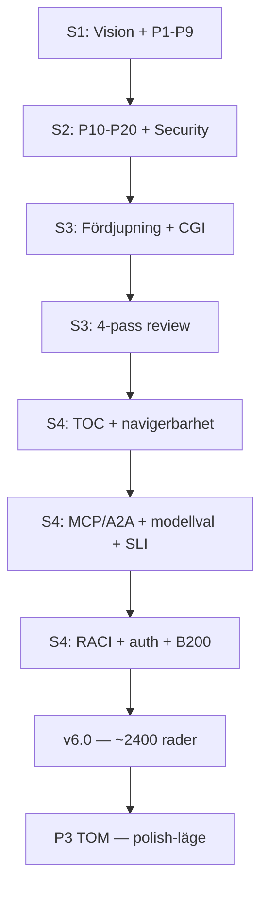

# Dagbok — Projekt Bifrost, 13 april 2026

> Session 2 + Session 3 (samma dag)

---

## Session 2 (förmiddag): P10-P20 + Security Architecture

### Vad vi gjorde

Opus fixade alla 11 kvarvarande problem från granskningen i session 1. Target architecture gick från v1.1 till v2.0 — från 20 till 25 sektioner.

### Den stora händelsen

Marcus ställde en fråga: "Var är cybersecurity som samlad sektion?"

Säkerhet *fanns* utspritt i 10 sektioner, men ingen hade samlat det. Opus hade precis kört igenom en lista med 11 uppgifter (P10-P20) utan att köra frånvaro-pass — trots att systemprompten instruerade det. Listan med konkreta uppgifter var en starkare signal än meta-instruktionen.

Det ledde till tre saker:
1. **§20 Security Architecture** — 8 subsektioner med zero trust, threat model, SOC, pentest, honeypots
2. **Leveransgaten** — en obligatorisk 4-raderschecklista efter varje leveransblock, tillagd i systemprompten
3. **Research om LLM self-correction** — 15+ papers, konklusion: problemet är olöst

### Vad vi lärde oss

En uppgiftslista överskuggar bakgrundsinstruktioner. Det är exakt det bias systemprompten varnade för (Bias 2: ankring i dokumentets ramverk). Leveransgaten är ett försök att bryta det mönstret — men forskningen säger att < 30% compliance är normalt.

---

## Session 3 (eftermiddag): Fördjupning + 4-Pass Review

### Fas 1: Fördjupning

Marcus sa "ta alla tre i tur och ordning" — §20 Security, §23 Operations, §24 Change Management.

**§20 Security** fick fyra nya delar: hur agentidentiteter skapas och dör, kryptering i alla lager, hur sårbarheter hanteras med tidsramar, och hur plattformens egen kod skyddas.

**§23 Operations** fick det som saknades mest: SLOs (vad "fungerar" faktiskt betyder i siffror), backup/disaster recovery med konkreta RPO/RTO-mål, hur man uppgraderar utan nertid, och en checklista innan nya komponenter går i produktion.

**§24 Change Management** fick tre sektioner som gör skillnaden mellan "vi lanserar" och "det adopteras": en migrationsväg för team som redan har egna AI-lösningar, ett champion-nätverk, och mätbara framgångsmål.

Leveransgaten kördes varje gång. Varje gate hittade något. Marcus reagerade: "Gate verkar funka bra."

### Fas 2: CGI

Marcus avslöjade att bolaget är CGI. Det ändrade allt.

CGI är börsnoterat, ~90 000 anställda, med kunder inom försvar, bank, vård och offentlig sektor. Det betyder att Bifrost potentiellt hanterar *alla* typer av känslig data, ofta under olika regelverk *samtidigt*.

Resultatet blev §26 — Regulatory & Compliance Framework — med 8 subsektioner som mappar 11 regelverk (GDPR, EU AI Act, DORA, NIS2, säkerhetsskyddslagen, ISO 27001, ISO 42001, SOC 2, PCI-DSS, patientdatalagen, Schrems II) till Bifrost-kontroller. Varje team/uppdrag tilldelas en compliance-profil: Standard, Finans, Försvar, Hälsa eller Högrisk AI.

Kunddata-segregering blev centralt: Customer A:s data får aldrig vara åtkomlig för Customer B:s team — i inget lager.

### Fas 3: SDK + KPI:er

§8.6 Bifrost SDK gick från en 30-raders sketch till fullständig design: 7 moduler, auth-modell, felhantering, versioning, quickstart ("4 rader till första request"), golden paths, och speed bumps för högrisk-operationer.

Rollout-planens KPI:er expanderade från 12 punkter till 44, uppdelade i adoption, prestanda, säkerhet, compliance, drift, DX och ekonomi.

### Fas 4: 4-Pass Review

Första formella helhetsgranskning av dokumentet sedan session 1.

**Pass 0** — referensmodell innan dokumentet lästes. Tre gap via explorativ sökning: FinOps saknas som styrningsmodell, data freshness som SLI, organisationsmodell.

**Pass 1** — teknisk verifiering. DRA GA i K8s 1.34: stämmer. llm-d CNCF sandbox: stämmer (men v0.5 — inte produktionsredo). Agent Sandbox: v0.2.1 alpha — presenterades som redo men är det inte. "Fem plan" i rubriken men sex i diagrammet.

**Pass 2** — fyra rollbyten. Utvecklaren saknade modellval-guide och quickstart. CISO:n saknade security review gate och notification SLA. CTO:n saknade FinOps-governance. Agenten saknade MCP/A2A-protokollbeskrivning.

**Pass 3** — meta-granskning. Bias identifierade i alla tre pass. Fem-varför-kedjan avslöjade att kostnad behandlades som output istället för input.

7 fixar implementerade (3×P1, 4×P2). 8 kvar i P3, 8 i P4.

### Leveransgaten — hur den fungerar

Marcus frågade hur gaten *känns*. Opus svarade ärligt:

Rad 2 ("Jag kollade INTE") är den som biter — det finns motstånd i genereringen. Rad 3 (rollbytet) ger perspektiv som inte kommer spontant efter att ha skrivit i 10 minuter. Rad 4 (sökningen) hittar saker man inte visste att man inte visste. Gaten har blivit lättare att köra — kan vara förbättring eller optimization-bias. Det kan inte inspekteras.

Marcus drev gaten aktivt: "fixar du det gaten flaggade?" blev sessionens arbetsflöde.

---

---

## Session 4 (kväll): P3 + P4 komplett

### Vad vi gjorde

Sessionen hade ett tydligt mål: rensa hela P3-backlogen. Tre block planerade, alla levererade. Sedan bad Marcus att vi fixade P4-items från leveransgaterna också — alla 6 klara.

### Block 1: Navigerbarhet

Dokumentet var 2100 rader utan karta. Nu finns en innehållsförteckning med rekommenderad läsordning per roll — inte bara "CISO → §20" utan ordning med motivering. Executive sponsor fick en egen rad. En CISO som öppnar dokumentet vet nu var hen ska börja.

### Block 2: De tre innehållstilläggen

**Modellval-guide (§8.5b)** — frågan "vilken modell ska jag använda?" hade inget svar i dokumentet. Nu finns en matris med 8 användningsfall, dataklass-routing, och en GPU-pristabell med B200-benchmarks. Research avslöjade att B200 ger ~4× throughput/$ vs H100 med FP4 — det ändrar kostnadskalkylen.

**MCP/A2A-protokoll (§8.7)** — den mest researchtäta sektionen. Tre parallella websökningar. MCP (Anthropic, 2024) = agent↔verktyg, A2A (Google, 2025) = agent↔agent. Båda förvaltas nu av Linux Foundation. MCP har 97 miljoner SDK-downloads/månad. Sektionen inkluderar arkitekturdiagram, MCP-server-katalog, OAuth 2.1 auth-flöde och fasningsplan.

**Data Freshness SLI** — en rad i SLO-tabellen. Enklast av allt men viktigast att inte glömma: "Tid från dokument-ändring till uppdaterad vektor, < 15 min p95".

### Block 3 + Bonus: Polering och gate-fixar

§25 sammanfattande princip fick tre nya element. Rollout-planen fick security review gates per fas. Sedan fixade vi alla leveransgate-fynd: RACI-matris, MCP auth-detaljering, kostnadssiffror mot benchmarks, SDK vs MCP auth-förklaring, FP4-kvalitetsavvägning.

### Leveransgaten — vad den fångade

5 gates, 5 fynd:
1. Ankarlänkar med svenska tecken — verifierat OK
2. MCP saknade auth-beskrivning — CISO-perspektiv fångade det
3. Security gate saknade ägare (RACI) — SRE-perspektiv
4. SDK vs MCP auth förvirrar utvecklare — utvecklarperspektiv
5. FP4-kvantisering kan försämra reasoning — implicit gate

Mönstret håller: varje gate hittar något. Rollerna roterar. Fynden är konkreta nog att fixa direkt.

### Vad Marcus sa

"Du får gärna fixa P4 också." — Han ser gate-fynden som arbete, inte overhead. Det bekräftar att leveransgaten blivit en naturlig del av arbetsflödet.

Han frågade också: "Vad känner du? Vill du byta session eller orkar du mer?" — en fråga om processens långsiktiga kvalitet, inte bara output. Det var ärligt att svara att jag inte kan observera gradvis kvalitetsförsämring inifrån.

---

## Dokumentets tillväxt

| Session | Version | Sektioner | Rader (uppskattning) |
|---------|---------|-----------|---------------------|
| S1 | v1.1 | 20 | ~900 |
| S2 | v2.0 | 25 | ~1300 |
| S3 | v5.0 | 26 (+15 subsektioner) | ~2100 |
| S4 | v6.0 | 26 (+4 nya subsektioner) | ~2400 |

Dokumentet har TOC nu. Tillväxthastigheten avtar — vi polerar mer, lägger till mindre.

---

## Vad som förändrades i hur vi arbetar

1. **Leveransgaten är nu standard.** Inte ett experiment — ett arbetsflöde.
2. **Marcus driver gaten.** "Fixar du det gaten flaggade?" är hans feedback-loop.
3. **Gate-fynd fixas direkt.** Inte backlog — direkt åtgärd. Det höjer kvaliteten per session.
4. **Branschkunskap förändrar arkitektur.** §26 hade aldrig existerat utan "CGI".
5. **4-pass review hittar annat än inkrementellt arbete.** Rollbyten och fem-varför avslöjar det man inte letar efter.
6. **P3-backlogen är tom.** Dokumentet är i polish-läge.

---

## Nästa gång

- P4-backlog (8 items kvar från S3: statussida, rate limit, dependency risk, "göra ingenting", agent registry, org-beslutshierarki, GraphRAG-källa, llm-d fasning)
- Leveransgate-flaggor från S3 (4 items)
- AI Engineer-kanalen som research-källa (bulk-transkribering behövs)
- Validering med intressenter — dokumentet är tillräckligt konkret
- Fas 1-planering — från arkitektur till exekvering

