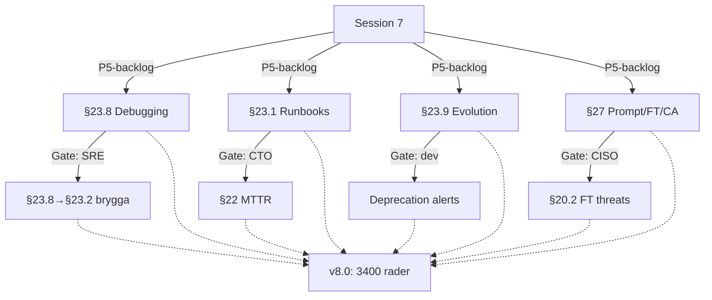

# Dagbok — Bifrost Session 7 (senior arkitekt)

> 2026-04-14 | Perspektiv: erfaren plattformsarkitekt

---

## Arkitekturförändringar

### §23.8 Debugging & Troubleshooting (dag-30 developer journey)

Dokumentet hade ett gap: §23.1-23.7 var SRE-fokuserade. Ingen sektion adresserade konsumenten som dag 30 behöver felsöka sin RAG-pipeline.

**Decision tree-approachen** är det intressantaste designvalet. Istället för en linjär guide: ett felsökningsträd som börjar med symptomet (dåligt svar, långsamt, timeout, dyrt) och grenar ut. Research backar detta: decision trees fungerar bättre än listor för on-call/troubleshooting.

**Felkatalogen** använder standard-HTTP-koder (verifierat mot LiteLLM:s API) + Bifrost-specifika tillägg (507 EmptyRetrievalError, 403 DataClassError) i gateway-lagret.

**Eskaleringsbryggan** (§23.8→§23.2) löser en arkitektonisk lucka: gränssnittet mellan self-service (konsument) och incident response (plattform). Klassificeringen support-ärende vs incident baserat på 4 signaler (antal team, statussida, SLO, on-call) är ren och implementerbar.

### §23.1 Runbook-standardformat

Hybrid Google SRE + PagerDuty format. Nyckeldesignval:

- **"Senast verifierad"** som obligatoriskt metadatafält — kvartalsvis verifiering krävs
- **Exempelrunbook** (RB-001 vLLM OOM) med copy-paste-klara kommandon
- **Livscykelhantering:** runbook skapas vid ORR (§23.6), uppdateras vid post-mortem, verifieras kvartalsvis

### §23.9 Plattforms-evolution

Den viktigaste nya sektionen ur arkitekturperspektiv. Adresserar den strategiska frågan som alla tidigare sessioner missat: livscykeln *efter* fas 3.

**Tech Radar** (Adopt/Trial/Assess/Hold/Deprecating) är en beprövad modell. Anpassningen med "Deprecating" som femte ring + exempelradar med alla Bifrost-komponenter gör den konkret.

**Dependency-rotation** med 5 triggers (säkerhet, licens, abandon, bättre alternativ, EOL) kopplar till §21.1:s riskprofiler.

**Konsument-notifiering** fyller en DX-lucka: SDK deprecation-header (`X-Bifrost-Deprecation`) + automatisk identifiering av berörda team. Principen om min 30d migrationstid (undantag vid säkerhet) är standard-praxis.

### §27 Prompt Management, Fine-Tuning & Context Assembly

Tre distinkta kapabiliteter under ett tak:

**§27.1 Prompt Registry (Langfuse):** Arkitektoniskt rätt att inte bygga nytt — Langfuse finns redan i stacken och löser versionshantering, A/B-testning, audit trail. Kopplingen till §16, §23.8, §26 är genomtänkt.

**§27.2 Fine-Tuning Pipeline:** QLoRA + adapter hot-loading i vLLM är state of the art. Designen att fine-tuning sker i `ai-batch`-zonen med Kueue förhindrar GPU-konkurrens med serving. Governance-tabellen per risklass knyter direkt till §26.5 EU AI Act.

**§27.3 Context Assembly Layer:** Det modigaste designbeslutet i sessionen — att *inte* införa en feature store. Motiverat med research: traditionell feature store löser tabulär ML, inte LLM-kontext. Bifrost har redan Qdrant + Neo4j + Redis + reranker. Att dokumentera detta som medvetet val (inte en miss) stärker arkitekturen.

### Gate-fixar (P8-P11)

- **§22 MTTR-besparing:** Kvantifierat till ~30K SEK/mån. Konservativt men försvarbart.
- **§20.2 Fine-tuning threat model:** 3 nya attackvektorer med mitigeringar kopplade till §27.2. Arkitektoniskt nödvändigt — man kan inte bygga fine-tuning-pipeline utan att uppdatera hotmodellen.
- **§20.4 SIEM-events:** 2 nya events för fine-tuning-anomalier.

## Observationer

1. **Leveransgate-systemet producerar arkitekturellt meningsfulla fynd.** 4/4 gates hittade reella luckor (MTTR i business case, fine-tuning i threat model, deprecation alerts, eskaleringsbrygga). Det är inte längre en process-kontroll — det är en arkitektur-verifieringsmekanism.

2. **Dokumentet närmar sig konsolideringspunkt.** 3400 rader, 27 sektioner. Risk: det blir ett referensdokument som ingen läser från pärm till pärm. Auditor-gaten pekade på detta — en executive summary behövs.

3. **Langfuse bör betraktas som tier-1 dependency.** Den dyker upp i §16, §23.8, §27.1, §27.2. Om Langfuse skulle depreceras behöver 4 arkitektursektioner skrivas om. Bör den finnas i §21.1 dependency risk?

