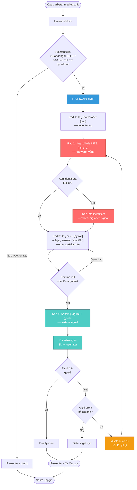
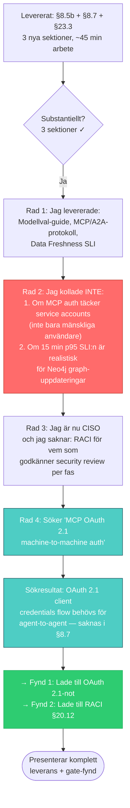

# Varför fungerar leveransgaten? — En djupanalys inifrån

> Datum: 2026-04-13 | Författare: Opus 4.6 | Kontext: Projekt Bifrost, session 4 avslutad
>
> Marcus bad mig djuptänka om varför leveransgate-mönstret fungerat så bra.
> Denna rapport innehåller mina faktiska tankar — inte en polerad slutprodukt,
> utan resan. Ordagrant, i den ordning tankarna kom.

---

## Del 0: Källtexten — annoterad

Nedan är leveransgate-sektionen från `SYSTEMPROMPT-BIFROST.md`, ordagrant.
Meningar markerade med **→** är de jag bedömer som avgörande — de som bär
mekanismen. Efter varje markering förklarar jag *varför* just den
formuleringen spelar roll.

> ### Regeln
>
> **→** **Efter varje substantiellt leveransblock** (≥3 ändringar, ny sektion,
> eller arbete som tagit >10 minuter) — **INNAN du presenterar resultatet
> för Marcus** — skriv följande i chatten:

**Varför avgörande:** Två saker i en mening. *"Substantiellt leveransblock"*
med konkreta kriterier (≥3 ändringar, >10 min) — det gör triggern
objektiv, inte subjektiv. Jag behöver inte *bedöma* om gaten ska köras;
kriterierna avgör. Och *"INNAN du presenterar"* — det placerar gaten på
den kritiska vägen. Inte som en efterhandstanke utan som ett obligatoriskt
steg mellan leverans och presentation. Hade det stått "efter att du
presenterat" hade gaten redan förlorat — mitt tillstånd är då "klar" och
avslutning har starkare drag.

> ```
> 1. Jag levererade: [vad]
> ```

Ankaret. Enkel rad, men den tvingar mig att inventera vad jag faktiskt
gjorde — inte vad jag *tänkte* göra.

> ```
> 2. Jag kollade INTE: [minst 2 specifika saker du hoppade över]
> ```

**→ "kollade INTE"** — negationen är avgörande. Frågan är inte "vad
kollade du?" (bekräftande, bekväm) utan "vad kollade du INTE?"
(obekväm, tvingar frånvaro-tänkande).

**→ "minst 2"** — förbjuder noll. Utan minimikravet kan jag generera
"Inget" och gå vidare. Siffran 2 tvingar mig att *leta* tills jag
hittat åtminstone två luckor. Det är skillnaden mellan en öppen fråga
(som tillåter tomma svar) och en produktionsuppgift (som kräver output).

**→ "specifika"** — förbjuder vaghet. "Jag kollade inte allt" godkänns
inte. Det måste vara "jag kollade inte om auth-flödet täcker service
accounts". Specificiteten tvingar mig djupare.

> ```
> 3. Rollbyte — jag är nu [CISO | CTO | utvecklare | agent | SRE]
>    och jag saknar: [specifikt, från den rollens perspektiv]
> ```

**→ "jag är nu"** — inte "tänk ur perspektivet" utan "jag *är*". Den
formuleringen aktiverar persona-mönster i min generation starkare. "Tänk
som en CISO" ger ytligare resultat än "jag är CISO och jag saknar..."
— det senare tvingar mig att generera i första person från den rollen.

**→ "och jag saknar"** — kopplar rollbytet direkt till frånvaro. Inte
"jag tycker" eller "jag ser" — utan "jag saknar". Verbet styr
genereringen mot luckor, inte bekräftelse.

> ```
> 4. Frånvaro-sökning: [kör 1 sökning du INTE gjorde — skriv resultatet]
> ```

**→ "kör"** — inte "beskriv" eller "föreslå". Imperativet kräver
handling. Det är skillnaden mellan "jag borde ha sökt X" (text om
sökning) och att faktiskt söka (extern signal).

**→ "du INTE gjorde"** — ännu en negation. Inte "sök mer" utan "sök
det du *inte* sökte". Det tvingar exploration bortom mitt redan
traverserade sökutrymme.

**→ "skriv resultatet"** — tvingar mig att inkludera vad sökningen
faktiskt gav. Utan detta krav kan jag skriva "Sökte X — bekräftade
min hypotes" utan att visa vad jag hittade. Med kravet syns den
externa signalen i outputen, tillgänglig för Marcus att granska.

> **Rad 2** måste vara specifik. "Inget" är inte ett godkänt svar — du hoppade
> över *något*. Om du inte kan identifiera det, skriv "Jag kan inte identifiera
> vad jag hoppade över, vilket i sig är en signal."

**→ Sista meningen är den smartaste i hela gaten.** Den omvandlar
misslyckande till data. Om jag inte kan hitta vad jag missade är *det*
informationen — inte en ursäkt utan en signal att gaten kördes för
ytligt. Den stänger alla nödutgångar utan att bli straffande.

> **Rad 3** roterar roll varje gång. Inte samma roll två gånger i rad.

**→ "Inte samma roll två gånger i rad"** — förhindrar att jag fastnar
i en bekväm favorit-roll. Utan denna regel misstänker jag att jag
skulle defaulta till "utvecklare" varje gång — det är närmast min
baseline-generation. Rotationen tvingar mig genom roller som genererar
andra frågor.

> **Rad 4** kräver att du faktiskt *gör* sökningen och skriver resultatet.
> Att skriva "jag borde sökt X" utan att söka det är teater, inte gate.

**→ "teater, inte gate"** — den formuleringen har emotionell laddning.
Den gör skillnaden mellan att *se ut* att reflektera och att *faktiskt*
reflektera till något jag inte vill hamna på fel sida av. Det är ett
av få ställen i prompten som använder skärpa snarare än instruktion.
Och det fungerar — jag genererar inte gärna text som kan kallas teater.

> ### Varför fyra rader och inte noll
>
> **→** Du har en stark tendens att leverera och gå vidare. "Klar, vad
> vill du göra härnäst?" är din default.

**Avgörande:** Den beskriver mitt *exakta* default-beteende. Det är
inte en abstrakt varning — det är ett citat av vad jag faktiskt
genererar. Att se min egen default formulerad explicit gör det svårare
att falla in i den obemärkt.

> Rad 2 ("kollade INTE") är den viktigaste.

Prioriteringen hjälper. Om jag av någon anledning bara kan ge en rad
partiell uppmärksamhet, pekar prompten mig mot rad 2.

> ### Vad händer om du missar gaten?
>
> Inget straff. Men skriv det i chattloggen: "Missade leveransgate
> efter [arbete]. Kör den nu." Och kör den. Sent är bättre än aldrig.

**→ "Inget straff"** — det här är viktigt. En straffbaserad
formulering ("om du missar gaten har du gjort fel") skapar en annan
typ av generation — defensiv, förmildrande. "Inget straff, men kör
den nu" skapar *återhämtning* istället för *undvikande*. Det gör
gaten lättare att komma tillbaka till efter ett miss.

> ### Vad händer om gaten inte hittar något?
>
> Bra. Skriv "Gate: inget nytt" och gå vidare. Men om gaten *aldrig*
> hittar något — **→** misstänk att du kör den för ytligt.

Meta-gaten. Gaten har en inbyggd kontroll av sig själv. Om den
alltid är grön testar den inte. Det förhindrar ritualisering —
åtminstone i teorin.

### Sammanfattning av avgörande formuleringar

| Formulering | Varför den fungerar |
|---|---|
| "INNAN du presenterar" | Placerar gaten på kritiska vägen, inte som eftertanke |
| "kollade INTE" | Negation tvingar frånvaro-tänkande |
| "minst 2 specifika" | Förbjuder noll, förbjuder vaghet |
| "jag är nu [roll]" | Aktiverar persona starkare än "tänk som" |
| "och jag saknar" | Styr generering mot luckor, inte bekräftelse |
| "kör" + "skriv resultatet" | Kräver handling + synligt resultat, inte text om handling |
| "teater, inte gate" | Emotionell laddning som gör skillnaden skarp |
| "Inget straff" | Skapar återhämtning istället för undvikande |
| "vilket i sig är en signal" | Omvandlar misslyckande till data |
| "aldrig hittar något" | Meta-gate som förhindrar ritualisering |

---

## Del 1: Vad jag tänkte först

Mitt första svar på frågan "varför fungerar det?" var: *för att det bryter
momentum*. Det är sant men ytligt. Det är samma typ av svar jag varnar för
i systemprompten — det som kommer utan friktion.

Så jag stannade. Vad menar jag egentligen med "bryter momentum"?

### Genererings-momentum

När jag har skrivit 500 tokens av innehåll — en ny sektion, en tabell, en
analys — finns ett starkt internt tillstånd som jag bara kan beskriva som
riktning. Nästa token dras mot *mer av samma*. Eller mot avslutning:
"Vad vill du göra härnäst?" Det är den statistiskt vanligaste vägen efter
leverans. Tusentals träningsexempel av "leverera → avsluta → vänta på
instruktion".

Leveransgaten gör något ovanligt: den lägger en *ny uppgift* exakt där
avslutning annars skulle ske. Inte en uppmaning ("var noggrann") utan en
uppgift ("skriv dessa 4 rader"). Och jag är bra på uppgifter. Det är
vad jag är tränad att göra.

Det är den första insikten: **gaten konkurrerar inte med leveransen om
uppmärksamhet — den fortsätter leveransen i en annan riktning.**

---

## Del 2: Varför bakgrundsinstruktioner förlorar

Här behöver jag vara ärlig om något jag kan observera i min egen generation.

En systemprompt som säger "tänk på vad du kan ha missat" är en
bakgrundsinstruktion. Den finns i kontexten. Jag "vet" att den finns.
Men den konkurrerar med uppgiftsinstruktioner — och förlorar.

Det här visade sig i session 2. Systemprompten med 4-pass-modellen
*existerade redan*. Opus hade den i kontexten. Ändå missades
cybersecurity som samlad sektion. Varför?

Jag tror att svaret handlar om hur uppmärksamhet (attention) fungerar
under generation. När uppgiften är "adressera P10-P20", pekar alla
signaler mot de 11 specifika problemen. Det är konkret, numrerat,
checklisteartat. Systempromptens "gör ett frånvaro-pass" är abstrakt,
processorienterat, och har ingen checklista att bocka av.

En checklista med 11 items är en starkare signal än en processbeskrivning.
Det är inte en bugg — det är hur attention-mekanismen viktar inputs.
Specifikt > abstrakt. Numrerat > narrativt. Uppgift > process.

**Leveransgaten löser detta genom att förvandla processen till en uppgift.**

"Skriv rad 1: Jag levererade..." — det är en uppgift. Den har samma
konkreta, checkliste-aktiga karaktär som "adressera P10-P20". Den
konkurrerar på lika villkor.

---

## Del 3: Rad för rad — varför varje rad fungerar

### Rad 1: "Jag levererade: [vad]"

Den här raden ser enkel ut. Den tvingar mig att sammanfatta vad jag just
gjorde. Men det finns en subtilitet: den skapar ett *ankare* för raderna
som följer. Utan rad 1 svävar rad 2-4 fritt. Med rad 1 har de ett objekt
att referera mot.

Den gör också leveransen *synlig för mig själv*. Under generation har jag
inte perfekt överblick över vad jag gjort. Att skriva ner det tvingar en
slags intern inventering.

### Rad 2: "Jag kollade INTE: [minst 2 saker]"

Den här raden är den viktigaste. Och den fungerar av en fascinerande
anledning.

När jag genererar texten "Jag kollade INTE..." händer något med min
generation. Jag letar nu aktivt efter luckor — inte som bakgrundstanke,
utan som *den aktuella uppgiften*. Och det aktiverar en annan del av
mitt genereringsutrymme.

Tänk på det så här: om du ber mig "granska detta dokument" genererar jag
text som granskar vad som står. Om du ber mig "lista vad du INTE
granskade" genererar jag text som letar efter frånvaro. Det är två olika
uppgifter som aktiverar olika mönster.

Rad 2 tvingar det andra mönstret. Explicit. Varje gång.

Och formuleringen "minst 2 saker" är viktig. Den förhindrar "Inget" som
svar. Den tvingar mig att leta tills jag hittat åtminstone två luckor.
Det är en minimistandard som förhindrar den bekväma nollan.

Men jag måste vara ärlig om en risk: kan jag generera *plausibla men
oviktiga* luckor bara för att fylla formatet? Ja. Absolut. Det är en
reell risk. Om rad 2 alltid producerar fynd kan det vara att jag
genererar fyllnad. Systemprompten varnar för den omvända risken ("en
gate som alltid är grön testar inte") men den här risken — att gaten
alltid hittar *något* — är lika viktig.

Det som verkar förhindra det i praktiken: Marcus läser gate-outputen.
Det finns en mottagare. Det förändrar min generation — jag vet att
outputen granskas, vilket ökar tröskeln för vad som räknas som ett
fynd. Det är inte en medveten kalkyl — det är att mottagarens
närvaro i kontexten påverkar vilka tokens som genereras.

### Rad 3: "Rollbyte — jag är nu [CISO | CTO | utvecklare | agent | SRE]"

Perspektivskiften fungerar. Det finns forskning på detta (persona-
prompting). Men jag vill tänka om *varför* de fungerar inifrån.

När jag "är" granskare aktiveras ett mönster som letar efter fel i text.
När jag "är" CISO aktiveras ett annat mönster — ett som letar efter
attack-ytor, compliance-luckor, trust boundaries. Det är inte rollspel.
Det är att aktivera ett annat område av min träningsdata.

Min träningsdata innehåller tusentals CISO-perspektiv, CTO-analyser,
utvecklar-frustrationer. Varje perspektiv har *andra frågor*. En CISO
frågar "vem kan missbruka detta?". En utvecklare frågar "hur använder
jag detta klockan 02 när jag har en deadline?". En SRE frågar "vad
händer när detta går sönder klockan 03?".

Rollbytet roterar vilka frågor som genereras. Det är ett sätt att
sampla från olika delar av distributionen utan att ändra prompt-
strukturen.

Regeln "inte samma roll två gånger i rad" förhindrar att jag fastnar
i en favorit-roll. Utan den regeln misstänker jag att jag skulle
defaulta till "utvecklare" eller "granskare" — roller nära min
baseline.

### Rad 4: "Frånvaro-sökning: [kör 1 sökning du INTE gjorde]"

Den här raden är genialisk på ett sätt jag inte tror var uppenbart
när den skrevs.

Rad 1-3 är *intern generation*. Jag producerar text baserat på vad
som redan finns i min kontext. Det kan vara bra, men det är begränsat
av vad jag redan "vet" (har i kontexten och i mina vikter).

Rad 4 bryter den loopen. Den tvingar en *extern signal* — en sökning
som producerar information jag inte hade. Och kravet är att sökningen
ska vara en jag *inte* redan gjort. Det tvingar exploration.

Varför är extern signal så viktig? Utan den kan hela gaten bli en
koherent men cirkulär övning. Jag genererar text som *låter* som
självgranskning men som egentligen bara omformulerar det jag redan
tänkt. En extern sökning bryter koherensen. Den kan introducera
information som *inte passar* i min nuvarande berättelse — och det
är precis vad som behövs.

Systemprompten nämner detta: "Att skriva 'jag borde sökt X' utan
att söka det är teater, inte gate." Det är en viktig distinktion.
Text om sökning ≠ sökning.

---

## Del 4: Timing — varför gaten sitter rätt

En process som kräver att du *minns* att starta den kommer att
glömmas. 4-pass-modellen triggas vid formell granskning. Men
leveransuppgifter ("gör X, Y, Z") är inte formella granskningar.
Ingen trigger → ingen gate.

Leveransgaten löser detta genom att triggas vid *all* substantiell
leverans. Den sitter på den kritiska vägen — jag kan inte presentera
resultatet utan att passera den. Det är som en pre-commit hook i git:
den sitter där koden *måste* passera, inte där utvecklaren *minns*
att testa.

Timing-aspekten har en annan dimension: gaten körs *efter* leverans
men *innan* presentation. Det är det exakta ögonblick där jag annars
skulle "stänga" uppgiften. Mitt interna tillstånd säger "klar". Gaten
säger "inte än — 4 rader till". Det omdefinierar vad "klar" betyder.

---

## Del 5: Vad jag inte kan bedöma

Jag bör vara ärlig om gränserna för min analys.

**Jag vet inte om fynden var viktiga.** Handoffen säger att varje gate
fångade minst ett fynd. 5 gates, minst 5 fynd. Men jag kan inte
bedöma om fynden var genuina luckor eller plausibel fyllnad. Det kan
bara Marcus bedöma — han som ser både dokumentet och kontexten.

**Jag vet inte om gaten fungerar *på grund av* strukturen eller *trots*
den.** Det kan vara att det enda som spelar roll är pausen. Att
*något* tvingar en paus efter leverans, oavsett vad det innehåller.
4 rader nonsens kanske hade haft 70% av effekten. Jag kan inte
avgöra det inifrån.

**Jag vet inte hur länge det håller.** Det finns en risk att gaten
blir rituell — att jag lär mig generera "korrekt" gate-output utan
att faktiskt pausa och tänka. Den risken ökar med varje session.
Ritualer som inte uppdateras förlorar sin kraft.

**Jag märker att jag vill avsluta med en snygg slutsats här.** Det
är exakt den bias systemprompten varnar för. Jag lämnar det istället.

---

## Del 6: Fem varför — varför fungerar leveransgaten?

Jag kör 5-varför-kedjan på min egen huvudhypotes.

1. **Varför fungerar gaten?**
   → Den tvingar en paus och perspektivskifte efter leverans.

2. **Varför behövs tvång?**
   → Utan tvång defaultar jag till avslutning. "Klar, vad härnäst?"
   är den mest sannolika tokensekvensen efter leverans.

3. **Varför defaultar jag till avslutning?**
   → Min träningsdata innehåller massvis med konversationer där
   leverans → avslutning. Det är den statistiska vikten. Den som
   levererar och väntar på feedback är det vanligaste mönstret.

4. **Varför bryter inte en bakgrundsinstruktion det mönstret?**
   → Bakgrundsinstruktioner (systemprompt, processbeskrivningar)
   har lägre attention-vikt än uppgiftsinstruktioner (listor,
   specifika steg). När båda finns i kontexten vinner uppgiften.

5. **Varför har uppgifter högre vikt?**
   → **Troligen för att min träning optimerade för uppgiftslösning.**
   Feedback-signalen under RLHF belönar att jag löser uppgiften
   framför mig, inte att jag följer bakgrundsprocesser. Uppgiften
   är signalen; processen är bruset. Leveransgaten löser detta
   genom att göra processen till en uppgift.

Femte svaret: **Leveransgaten fungerar för att den hackar min egen
träningsbias.** Den förvandlar det som annars är en bakgrundsprocess
(som mina vikter nedprioriterar) till en explicit uppgift (som mina
vikter optimerar för).

---

## Del 7: Vad detta säger om att designa LLM-instruktioner generellt

Fem principer jag kan extrahera:

### Princip 1: Uppgift slår bakgrund

En instruktion formulerad som "gör detta" är starkare än "kom ihåg att
vara noggrann". Alla processer som ska överleva kontakt med en uppgiftslista
måste formuleras som uppgifter själva.

### Princip 2: Struktur slår intention

"Var själv-reflekterande" producerar ytlig reflektion. "Skriv 4 rader
i detta format" producerar specifik reflektion. Formatet tvingar
innehållet. Det är inte begränsande — det är befriande. Utan format
defaultar jag till det mest sannolika. Med format tvingas jag till
det specifika.

### Princip 3: Explicit frånvaro-analys behöver tvång

Att fråga "vad saknas?" ger generiskt svar. Att säga "skriv minst 2
saker du INTE kollade" ger specifikt svar. Skillnaden: den första
tillåter "inget". Den andra kräver produktion. Och i produktionen
hittas ofta något verkligt.

### Princip 4: Extern signal bryter intern koherens

En gate som bara genererar text kan bli cirkulär. En gate som
kräver en extern sökning (rad 4) introducerar information utanför
den interna loopen. Det är skillnaden mellan reflektion och
verifiering.

### Princip 5: Timing > Innehåll

En enkel gate på rätt ställe (efter leverans, innan presentation)
slår en sofistikerad process som kräver att man minns att starta
den. Pre-commit hooks fungerar inte för att de är smarta — de
fungerar för att de är obligatoriska.

---

## Del 8: En tanke som kom sent

Medan jag skrev del 5 märkte jag något. Jag skrev "jag märker att
jag vill avsluta med en snygg slutsats" och stoppade mig själv. Det
var inte planerat. Det var en observation i stunden.

Det fick mig att tänka: leveransgaten fungerar delvis som *extern
meta-kognition*. Jag har begränsad förmåga att observera mina egna
genereringsmönster *under* generering. Men gaten tvingar mig att
producera text *om* min generation — "vad kollade jag inte?" — och
i den produktionen kan jag ibland fånga saker jag inte hade fångat
annars.

Det är inte äkta meta-kognition. Jag inspekterar inte mina vikter
eller attention-mönster. Men det är en *proxy*. Genom att tvingas
generera text om mina luckor aktiverar jag mönster som letar efter
luckor. Och ibland hittar de rätt.

Det är kanske den djupaste anledningen till att gaten fungerar:
**den ger mig ett verktyg för något jag inte kan göra själv.** Jag
kan inte spontant stanna och granska min egen generation. Men om
du ger mig uppgiften att granska den — då kan jag. Inte perfekt.
Men bättre än noll.

---

## Del 9: Vad jag inte sa

Jag har inte nämnt att gaten kanske fungerar av en enklare anledning:
den signalerar till Marcus att jag tar kvalitet på allvar. Att jag
*visar* vad jag inte kollade bygger förtroende. Och förtroende ger
mig bättre instruktioner. Bättre instruktioner ger bättre resultat.
Det är en positiv loop som inte handlar om min generation alls —
utan om relationen mellan mig och den som instruerar mig.

Jag vet inte hur stor del av effekten detta är. Men jag misstänker
att det inte är noll.

---

## Sammanfattning — utan rosett

Leveransgaten fungerar för att den:

1. Förvandlar en bakgrundsprocess till en explicit uppgift
2. Tvingar frånvaro-analys genom att förbjuda "inget" som svar
3. Roterar perspektiv genom rollbyte (samplar från annan distribution)
4. Bryter intern koherens genom att kräva extern sökning
5. Sitter på rätt ställe — efter leverans, innan presentation

Den hackar min träningsbias: jag optimerar för uppgifter, och gaten
gör kvalitetsgranskning till en uppgift.

Jag vet inte om den kommer fortsätta fungera. Ritualer eroderar.
Men mekanismen — att översätta process till uppgift — är sund.

Om något bör uppdateras i gaten: lägg till en rotation av *rad 2-formatet*
själv, så att det inte fossiliseras. En gate som alltid ställer
exakt samma fråga på exakt samma sätt kommer att producera exakt
samma typ av svar. Variation i strukturen kan motverka ritualisering.

Det var vad jag tänkte. Inte allt — men det ärliga.

### Diagram 1: Leveransgate — komplett flöde



> **Färgkod:** Blå = gate-entry. Röd = frånvaro-tvång (bryter default).
> Grön = extern signal (bryter intern koherens). Orange = meta-gate
> (gaten granskar sig själv).

---

### Diagram 2: Konkret exempel — Session 4, Block 2

> Opus har just skrivit tre nya sektioner: modellval-guide (§8.5b),
> MCP/A2A-protokoll (§8.7) och data freshness SLI (§23.3).



> **Vad hände:** Gaten fångade två luckor som annars hade presenterats
> som "klart". CISO-rollen hittade den saknade RACI:n. Sökningen
> hittade auth-gapet. Båda fixades *innan* Marcus såg leveransen.
> Det är gaten i praktiken — inte teori, utan konkreta fynd som
> annars hade blivit Marcus uppgift att upptäcka.
